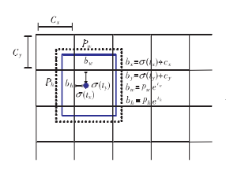

# OCR 学习笔记

## 一、学习论文

### 1《基于深度学习的OCR文字识别在银行业的应用研究》

论文在梳理了OCR识别完整流程的基础上，分别在图像预处理的倾斜校正、文本区域检测和文字识别部分引入了深度卷积神经网络以优化OCR的文字识别效果，然后设计并实现了基于深度学习的OCR解决方案，针对银行业务数据对搭建模型进行训练，最后对所设计的OCR方案进行实验验证

基于深度学习的OCR解决方案主要包括==图像预处理==、==文本区域检测==、==序列文字识别==和==识别结果后处理==四个模块，其流程如图所示

其中，基于网格的==文本区域检测==与==序列文字识别==是OCR识别的==关键==

图像预处理步骤中图像中文字方向判定使用==预训练的VGG16网络==进行迁移学习实现文字方向的倾斜校正

文字识别结果的后处理阶段暂时通过==正则表达式==匹配识别结果中关键字的方式提取行识别结果中的关键信息，下一步将引入==NLP==的词法切分及语法匹配方法进一步优化OCR识别结果后处理

#### 1.1 图像预处理

银行业务系统获取到的场景图像数据由于受到用户拍摄习惯、取景需求和随机干扰等条件的限制导致图像质量有所差异，在OCR识别任务开始前，首先对获取到的图像进行==图像增强==、==高斯滤波去噪==、==边缘检测==、==倾斜校正==等图像预处理操作

> # 图像增强
>
> 按照特定的需要去除或者突出图像中的某些信息，改善图像的视觉效果，使图像更适合分析一般主要分为两种方法，空间域和频率域
>
> **空间域**是直接在图像像素上操作
>
> - 线性变换------可以应用在由于照明不足，图像对比度比较低的情况中，通过分段的线性变换函数，来对图像对比度进行拉伸
> - 非线性变换------对数变换完成图像灰度级的扩展或者压缩伽马变换可以用在电脑的显示器或者网站中图像的伽马校正，也可以用在图像的对比度增强中
> - 加法运算------对于有噪声的图像，通过图像多张叠加求平均，可以对图像进行降噪
> - 减法运算------图像相减常用于医学图像处理来消除背景也可以用在运动检测中
> - 乘法运算------获取对图像感兴趣的部分，保留感兴趣区域
> - 直方图均衡------改善图像亮度和对比度
> - 均值滤波------去除图像高斯噪声
> - 高斯低通滤波-----是一种加权策略的均值滤波，用来降低噪声          
> - 中值滤波器-----有效去除脉冲噪声，也叫椒盐噪声
> - Laplace算子-----是一种微分算子，应用强调在图像中灰度的突变区域，并不强调灰度级缓慢变化的区域
> - Sobel算子-----主要用在工业检测图像的边缘检测
>
> **频率域**是在图像的傅里叶变换上操作
>
> - 频率域低通滤波-----去除边缘和噪声
> - 频率域高通滤波-----把低频图像平滑的区域去掉
> - 频率域同态滤波-----主要用于减少由于光照不均匀引起的图像降质,并对感兴趣的景物进行有效地增强能够减少低频并且增加高频，锐化边缘细节
>
> # 高斯滤波去噪
>
> 高斯滤波器是根据高斯函数来选择权值的线性平滑滤波器，对随机分布和服从正态分布的噪声有很好地滤除效果
>
> # 边缘检测
>
> 经过增强的图像，往往领域中有很多点的梯度值比较大，而在特定的应用中，这些点并不是我们要找的边缘点，3所以应该采用某种方法来对这些点进行取舍。实际工程中，常用的方法就是通过阈值化方法来检测
>
> 在边缘部分，像素值出现“跳跃”或者较大的变化，如果在此边缘部分求一阶导数，就会看到极值的出现，而在一阶导数为极值的地方，二阶导数为0，基于这个原理，就可以进行边缘检测
>
> # 倾斜校正
>
> 有时候文本是倾斜的，则不利于文本识别，如下图所示，那么进行文本识别之前我们需要应用文本倾斜校正算法（text skew correction，deskewing text）。对于一幅包含旋转文本块的图像，我们需要通过以下方式纠正文本倾斜：
>
> - 检测图像中的文本块
> - 确定文本块的倾斜角度和倾斜方向
> - 旋转图像以校正倾斜的文本

业务经理在文档扫描过程中经常存在==0°==、==90°==、==180°==、==270°==方向的倾斜，其他角度倾斜的情况并不常见。针对银行业扫描业务文档数据获取到的图像倾斜的特点，将OCR识别前的==倾斜校正转换为分类问题==，并基于深度卷积神经网络实现图像分类以解决银行图像业务数据中文字方向的倾斜角度判定

VGG16网络中卷积层和全连接层的层数为16层，其网络结构如图所示。为了保留VGG16预训练网络在卷积层和全连接层已经训练好1 000类的网络参数，基于商业银行存在的0°、90°、180°、270°倾斜情况替换了VGG16网络的最后一个fc层，将目标分类结果替换为四类，OCR识别任务开始前，经迁移学习后的VGG16网络检测到图像中文字方向的倾斜角度，对图像进行相应角度的旋转，以便于文字区域检测与识别任务的执行

白色部分为卷积层，红色部分为池化层（使用最大池化），蓝色部分为全连接层，VGG16网络为13层卷积层+3层全连接层而组成

> # VGG16
>
> **图片数据如何输入**
>
> 彩色图像有RGB三个颜色通道，分别是红、绿、蓝三个通道，这三个通道的像素可以用二维数组来表示，其中像素值由0到255的数字来表示。比如一张像素为 160x60 的彩色图片，可以用 160 * 60 * 3 的数组表示
>
> 
>
> **什么是卷积**
>
> - 卷积过程是使用一个卷积核（如图中的Filter），在每层像素矩阵上不断按步长扫描下去，每次扫到的数值会和卷积核中对应位置的数进行相乘，然后相加求和，得到的值将会生成一个新的矩阵
> - 卷积核相当于卷积操作中的一个过滤器，用于提取我们图像的特征，特征提取完后会得到一个特征图
> - 卷积核的大小一般选择3x3和5x5，比较常用的是3x3，训练效果会更好。卷积核里面的每个值就是我们需要训练模型过程中的神经元参数（权重），开始会有随机的初始值，当训练网络时，网络会通过后向传播不断更新这些参数值，直到寻找到最佳的参数值。对于如何判断参数值的最佳，则是通过loss损失函数来评估（损失函数一般指训练样本预测值y'与真实值y之间的误差，在非过拟合的情况下我们希望loss越小越好(一般loss都是大于0的)，loss越小表明预测值和真实值越接近）
>
> 
>
> **什么是padding**
>
> 在进行卷积操作的过程中，处于中间位置的数值容易被进行多次的提取，但是边界数值的特征提取次数相对较少，为了能更好的把边界数值也利用上，所以给原始数据矩阵的四周都补上一层0，这就是padding操作
>
> 在进行卷积操作之后维度会变少，得到的矩阵比原矩阵要小，不方便计算，原矩阵加上一层0的padding操作可以很好的解决该问题，卷积出来的矩阵和原矩阵尺寸一致
>
> **什么是池化pooling**
>
> 池化操作相当于降维操作，有最大池化和平均池化，其中最大池化(max pooling)最为常用
>
> 经过卷积操作后我们提取到的特征信息，相邻区域会有相似特征信息，这是可以相互替代的，如果全部保留这些特征信息会存在信息冗余，增加计算难度
>
> 通过池化层会不断地减小数据的空间大小，参数的数量和计算量会有相应的下降，这在一定程度上控制了过拟合
>
> 
>
> **什么是Fletten**
>
> Flatten将池化后的数据拉开，变成一维向量来表示，方便输入到全连接网络
>
> **什么是全连接层**
>
> 对n-1层和n层而言，n-1层的任意一个节点，都和第n层所有节点有连接。即第n层的每个节点在进行计算的时候，激活函数的输入是n-1层所有节点的加权
>
> **什么是Dropout**
>
> 在训练过程中，按照一定的比例将网络中的神经元进行丢弃，可以防止模型训练过拟合的情况
>
> **什么是神经元**
>
> 深度学习中最基本的概念:神经元,流行的神经网络,几乎是由不同方式组合的神经元组成。一个完整的神经元主要由==线性函数==和==激活函数==两部分组成
>
> - ==激活函数(激发函数)==：激活函数就是给神经元添加非线性因子。因为线性函数所能表达的内容有很大的局限性,现实中很多问题都是非线性的,所以加入非线性因素可以增加模型的拟合效果
> - ==线性函数==: y = wx + b（线性函数的公式就是这样表示的,其中x代表输入,y代表输出,w代表权重,b代表偏差）
> - 输入：神经元处理前的数据,x不一定是数字,也可以是矩阵或其他数据
> - 输出：神经元处理的数据。输出数据也可以是各种形式的数据,由输入数据和神经元决定
> - 权重：进入神经元时相乘的数据可以是数字也可以是矩阵。通常,初始权重是随机设置的。训练结束后,计算机会调整权重,对比较重要的特征赋予较大的权重,反之,对不重要的特征赋予较小的权重
> - 偏差：输入和权重相乘的结果加上线性分量,可以增加线性范围

#### 1.2 文本区域检测

YOLO 模型将一幅图像分成 S×S 个网格，每个网格独立检测，如果某个对象(object)的中心点坐标落在这个网格内，则此网络负责预测此object。每个网格预测B个bounding box，每个bounding box除了回归自身位置之外，还预测一个 confidence 值，此 confidence 值代表了所预测的 bounding box 中含有 object 的置信度和这个box预测的准确度

文字区域检测网络模型使用 DarkNet-53 模型提取图像特征，DarkNet-53 网络使用 3×3 和 1×1 的卷积核及 residual 块，没有池化(pooling)层和全连接层

下图为模型在卷积层所提取特征图上的文字区域边框预测，预测 boun-ding box 的中心点相对于当前网格(grid cell)的偏移量，cx、cy是卷积神经网络提取的特征图中的grid cell的左上角坐标，每个grid cell在feature map中的宽和高均为1，如图3右上角所示，预测bounding box边界框的中心位于第二行第二列的gridcell，因此左上角坐标为(1，1)，故cx=1，cy=1;tx和ty分别为经过sigmoid输出0～1的偏移量，与cx、cy相加后得到bounding box中心点的位置，预测得到的边框坐标值bx、by、bw、bh为边界框bounding box相对于特征图 feature map 的位置和大小

> # 目标检测
>
> 目标检测的核心问题可以简述为==图像中什么位置有什么物体==
>
> 基于深度学习的目标检测算法目前主要分为两类：==Two-stage== 和 ==One-stage==
>
> 
>
> ###### Tow-stage
>
> 先生成一个可能包含待检物体的预选框区域（RP），再通过卷积神经网络进行分类，常见 Two-stage 目标检测算法有：R-CNN、Fast R-CNN 等
>
> 任务流程：特征提取 --> 生成 RP --> 分类/定位回归
>
> **One-stage**
>
> 直接用网络提取图像特征来预测物体位置和分类，因此不需要 RP，常见的 One-stage 目标检测算法有：YOLO 系列、SSD 等。不过，为了得到最终目标的定位和分类，往往需要后处理
>
> 任务流程：特征提取–> 分类/定位回归
>
> 
>
> # YOLO
>
> 我们的系统将输入图像划分为S×S网格，具有分而治之的思想。如果对象的中心落入网格单元中，则该网格单元负责检测该对象
>
> 如图所示，狗的中心落在了红点所示位置，那么这个格子负责预测狗这个对象。这里需要说明一下，网格只是划分图像中物体的位置，而不是将每个格子单独分离出来，所有的网格还是一个整体关系。因此，YOLO在训练和测试时都会全局考虑图像
>
> 每个网格需要预测B个bounding box，每个bounding box除了需要预测位置坐标、预测confidence值以外，还需要去预测C个类别的分数，confidence为置信度，是指bounding box中存在物体的概率，C与数据集的类别相关
>
> 每个边界框需要预测5个值：x, y, w, h, confidence。(x, y)表示预测框相对于网格单元边界的中心；(w, h)表示预测框相对于整个图像预测宽度和高度；置信度表示预测框与真实框之间的IOU。置信度的计算公式如下所示
>
> - Pr(object)表示网格单元中是否有object，如果有object，则为1，否则为0
> - IOU(b, object)表示真实框与预测框之间的交并比，表示bbox位置的准确性
> - 网络输出维度为：S×S×(B×5+C)
>
> 
>
> 
>
> 
>
> # DarkNet-53
>
> 网络主要是由一系列的1x1和3x3的卷积层组成层。Darknet-53中总共有6个单独的卷积层和23个Residual，每个Residual包含2个卷积层（一个1×1，一个3×3），所以Darknet-53中共有52层卷积，前52层只用作特征提取，最后一层是用于输出预测值的，故加上输出那一层称为 Darknet-53，其网络结构如图
>
> 
>
> Darknet-53引入了大量的==残差结构==，而且每两个残差结构之间插着一个步长为2，卷积核大小为3×3卷积层Conv2D代替池化层Maxpooling2D，用于完成下采样的操作，Darknet-53只用于提取特征，所以没有池化(pooling)层和全连接层
>
> ***残差结构**：加入残差结构Residual的目的是为了增加网络的深度，用于支持网络提取更高级别的语义特征，同时残差的结构可以帮助我们避免梯度的消失或爆炸。因为残差的物理结构，反映到反向梯度传播中，可以使得梯度传递到前面很远的网络层中，削弱反向求导的链式反应；同时在相当程度上帮助网络减少了计算量，使得网络的运行速度更快，效率更高*
>
> 如图展示了Darknet-53中堆叠的残差单元的结构图。其中Input和Output分别是残差单元的输入和输出，In_channels是输入的通道数，h，w分别为输入的高和宽
>
> 

#### 1.3 序列文字识别

序列文字识别模型采用标准CNN模型(去除全连接层)中的卷积层和最大池化层构造卷积层组件，用于从输入图像中提取序列特征表示，特征向量序列作为循环层的输入。循环层预测特征序列x=x1，x2，…，xT中每一帧xt的标签分布yt，RNN具有较强的捕获序列内上下文信息的能力，对于基于图像的序列识别使用上下文提示比独立处理每个符号更稳定且更有帮助，如一些较宽的字符可能需要连续的帧完全描述

传统的RNN单元存在梯度消失的问题，这限制了其可以存储的上下文范围，并给训练过程增加了负担。因此模型采用了长短时记忆网络(LSTM)解决梯度消失的问题，LSTM由一个存储单元和三个多重门组成，即输入门、输出门和遗忘门，存储单元存储过去的上下文，输入和输出门允许单元长时间地存储上下文信息，同时单元中的存储可以被遗忘门清除，LSTM的特殊设计允许其捕获长距离依赖

> # CNN
>
> CNN是一种利用卷积计算的神经网络。它可以通过卷积计算将原像素很大的图片保留主要特征变成很小的像素图片
>
> ###### 为什么使用CNN（卷积神经网络）
>
> 如果一般地用fully network（全连接）神经网络处理的话，我们会需要很多的参数，例如如果input的vector是个30000维，第一个hidden layer假设是1000个神经元，那么第一个hidden layer就会30000*1000个，数据量非常大，导致计算效率和准确率效果低，引入CNN，就是为了简化我们神经网络架构
>
> ###### 为什么使用比较少的参数就足够进行图像处理
>
> - 大部分的patterns要比整张图片小，一个神经元不需要去观察整个图片，只需要观察图片的一小部分就能找到一个想要的pattern，例如：给定一张图片，第一个hidden layer的某个神经元找图像中的鸟的嘴，另一个神经元找鸟的爪子，找爪子时就可以不用找嘴
> - 不同位置的鸟嘴只需要训练一个识别鸟嘴的参数就Ok了，不需要分别训练
> - 我们可以采用子样品来使图片变小，子样不会改变目标图像
>
> 
>
> ###### 卷积神经网络详解
>
> 与常规神经网络不同，卷积神经网络的各层中的神经元是3维排列的：宽度、高度和深度。其中的宽度和高度是很好理解的，因为本身卷积就是一个二维模板，再配合卷积神经网络中的激活数据体作为第三个维度（不是整个网络的深度，==整个网络的深度指的是网络的层数==）
>
> 层中的神经元将只与前一层中的一小块区域连接，而不是采取全连接方式。在卷积神经网络结构的最后部分将会把全尺寸的图像压缩为包含分类评分的一个向量，向量是在深度方向排列的，如图是全连接神经网络和卷积神经网络的区别
>
> 上图是一个3层的神经网络，下图是一个卷积神经网络，将它的神经元在成3个维度（宽、高和深度）进行排列。卷积神经网络的每一层都将3D的输入数据变化为神经元3D的激活数据并输出。在下图，红色的输入层代表输入图像，所以它的宽度和高度就是图像的宽度和高度，它的深度是3（代表了红、绿、蓝3种颜色通道），与红色相邻的蓝色部分是经过卷积和池化之后的激活值（也可以看做是神经元） ，后面是接着的卷积池化层
>
> 
>
> 
>
> 卷积神经网络主要由这几类层构成：输入层、卷积层，ReLU层、池化（Pooling）层和全连接层（全连接层和常规神经网络中的一样）。通过将这些层叠加起来，就可以构建一个完整的卷积神经网络。在实际应用中往往将卷积层与ReLU层共同称之为卷积层，所以卷积层经过卷积操作也是要经过激活函数的
>
> 卷积层和全连接层对输入执行变换操作的时候，不仅会用到激活函数，还会用到很多参数，即神经元的权值w和偏差b；而ReLU层和池化层则是进行一个固定不变的函数操作。卷积层和全连接层中的参数会随着梯度下降被训练，这样卷积神经网络计算出的分类评分就能和训练集中的每个图像的标签吻合了
>
> ==卷积层==：卷积层是构建卷积神经网络的**核心层**，卷积层由若干卷积单元组成，每个卷积单元的参数都是通过==反向传播算法==最佳化得到的。卷积运算的目的是提取输入的不同特征，第一层卷积层可能只能提取一些低级的特征如边缘、线条和角等层级，更多层的网路能从低级特征中迭代提取更复杂的特征
>
> ==池化层==：通常在连续的卷积层之间会周期性地插入一个池化层。它的作用是逐渐降低数据体的空间尺寸，这样的话就能减少网络中参数的数量，使得计算资源耗费变少，也能有效控制过拟合
>
> ==反向传播==：其中max(x,y)函数的反向传播可以简单理解为将梯度只沿最大的数回传。因此，在向前传播经过汇聚层的时候，通常会把池中最大元素的索引记录下来
>
> ==ReLU层==：是一个激活函数，卷积神经网络中，使用该函数的作用是去除卷积结果中的负值，保留正值不变，激活函数只在输入大于0时才激活一个节点，当输入小于0时，输出为零，当输入大于0时，输出等于输入
>
> 卷积神经==网络结构==通常是由三种层构成：卷积层，汇聚层和全连接层（简称FC）。ReLU激活函数也应该算是是一层，它逐元素地进行激活函数操作，常常将它与卷积层看作是同一层
>
> 
>
> # RNN
>
> ###### 为什么需要 RNN （循环神经网路）
>
> 无论是卷积神经网络，还是人工神经网络，他们的前提假设都是：元素之间是相互独立的，输入与输出也是独立的，但现实世界中，很多元素都是相互连接的，因此，就有了现在的循环神经网络，他的本质是：像人一样拥有记忆的能力。因此，他的输出就依赖于当前的输入和记忆。循环神经网络是一类具有短期记忆能力的神经网络。在循环神经网络中，神经元不但可以接受其它神经元的信息，也可以接受自身的信息，形成具有环路的网络结构
>
> ###### 网络结构
>
> 一个简单的循环神经网络如，它由输入层、一个隐藏层和一个输出层组成
>
> x是一个向量，它表示**输入层**的值，s是一个向量，它表示**隐藏层**的值，U是输入层到隐藏层的**权重矩阵**，o也是一个向量，它表示**输出层**的值，V是隐藏层到输出层的**权重矩阵**，**循环神经网络**的**隐藏层**的值s不仅仅取决于当前这次的输入x，还取决于上一次**隐藏层**的值s。**权重矩阵** W就是**隐藏层**上一次的值作为这一次的输入的权重
>
> 
>
> 
>
> ###### 为什么引入 LSTM（长短期记忆网络）
>
> 由于这样的循环体的复制有一个问题就是，下一时刻只是受到了上一时刻输出的影响，而实际上下一时刻的结果在处理自然语言的时候往往需要结合上文中很多时刻值的影响，这就是RNNs最大的不足，而且网络是根据输入而展开的，输入越多展开越长，就月有可能回导致梯度消失（gradient vanish）和梯度爆炸
>
> Long Short Term网络，又被称作LSTM，是一种RNN特殊的类型，可以学习长期依赖信息，LSTM通过刻意的设计来避免长期依赖问题。记住长期的信息在实践中是LSTM的默认行为，而非需要付出很大代价才可以获得的能力
>
> 所有递归神经网络都是具有重复模块的链式结构，在标准RNNs中，这个重复的模块具有非常简单的结构，例如单个tanh层
>
> 
>
> LSTMs也有这种链状结构，但是其中的重复模块有不同的结构。它不是只有一个神经网络层，而是有四个，以非常特殊的方式相互作用
>
> LSTM的关键之处是单元状态(cell，最上面的线)，单元状态就像一个传送带。它直接沿着整个链运行，只有一些简单的加减等线性操作，信息很容易保持不变。LSTM建立一条单独的“路线”用来传递长时依赖关系，每个LSTM单元只对这条通路上做一些简单的加减操作，以保证长时依赖信息不被破坏
>
> LSTM中红色的主线传递是长时记忆，而蓝色的主线传递的是短时记忆
>
> 
>
> 
>
> 
>
> 
>
> # LSTM 结构
>
> 主要包含了三个门（遗忘门、输入门、输出门）与一个记忆单元（cell）
>
> LSTM的第一步是决定我们要从单元状态中舍弃什么信息。这一步由激活函数为sigmoid的神经层决定，我们称之为遗忘门
>
> LSTM的第二步决定将要在单元状态(cell)中存储哪些新的信息。这由两个部分组成。首先，激活函数为sigmoid的称为输入门
>
> LSTM的第三步将决定输出的内容，这由输出门决定

#### 1.4 识别结果后处理

OCR方案通过准确定位图像中文本行的方式实现序列的文字识别，模型的识别结果为图像中基于行文本框的所有文字信息，而这些信息无法直接存入数据库进行分析，因此需要将识别结果中的关键信息进行进一步提取分析，通过正则表达式匹配识别结果中关键字的方式提取行识别结果中的关键信息(如身份证OCR识别结果中提取出姓名、性别、民族、出生年月、住址、身份证号码属性对应具体值，然后直接存储至身份证信息表)，并针对不同类型图像设计相应匹配模板

> **例如**
>
> 姓名：\b\w{2.5}
>
> 身份证号：\b\d{18}
>
> 地址：\b\w{10,}

## 二、学习笔记

### 1. OCR

OCR一般包括==文本检测==和==文本识别==两个核心子任务

#### 1.1 传统 OCR

在深度学习技术发展之前，传统的OCR文本检测依赖于一些浅层次的图像处理方法或者图像分割方法以及一些复杂繁琐的后处理技术进行文字定位，传统OCR所处理的对象往往局限于成像清晰、背景干净、字体简单而同时又排列规整的文档图像

#### 1.2 深度学习 OCR

随着深度学习的发展，及其在图像识别、语音识别、自然语言处理等领域展现出的巨大优势，基于深度神经网络的模型已经主导了场景文本检测和识别领域，从R-CNN到Faster R-CNN，再到Mask RCNN，基于深度学习的OCR识别方法以绝对优势从众多机器学习算法中脱颖而出

基于深度学习的目标检测模型可以分为两类，单阶段模型在检测速度上更快，两阶段模型在准确度上有优势

一类是==基于目标候选区域==的算法，其将==检测算法划分为两个阶段，首先产生候选区域，然后对候选区域进行分类和边界框回归==，如R-CNN、Fast R-CNN、Faster R-CNN、R-FCN等

二类是==基于回归==的方法，==不需要产生候选区域，直接得到物体的类别概率和位置目标==，典型模型如 YOLO（You Only Look Once） 和 SSD 算法

## 三、算法学习
