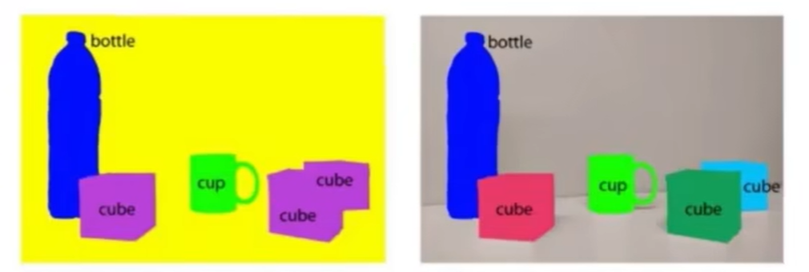

# 深度学习、目标检测

## 一、目标检测基础知识

### 1 目标检测问题定义

==目标检测==是在图片中对可变数量的目标进行==查找==和==分类==，即==目标位置定位==与==目标类别分类==

- 目标种类与数量问题
- 目标尺度问题
- 外在环境干扰问题

### 2 图像分类、目标分割、目标检测

==目标检测==：确定目标在给定图像中的位置，如目标定位，以及每个目标属于哪个类别，即目标分类

==图像分类==：对图像中特定对象的类别进行分类或预测的技术，该技术的主要目的是准确识别图像中的特征

==目标分割==：需要找到当前的目标所占的区域（==语义分割==：同一类目标所占区域，==实例分割==：不仅要区分不同**语义**层面上的目标，而且对于同一类别的目标，也要划分出不同的**实例**）

**传统的机器学习方法中会手动设置一些特征来完成特征提取，深度学习中通常通过卷积神经网络完成特征的抽取**。目标检测和图像分类都属于计算机视觉领域比较基础的应用

### 3 目标检测方法的变迁

### 4 目标检测算法的基本流程

#### 传统目标检测算法

- Viola-Jones（人脸检测）
- HOG+SVM
- DPM（==传统目标检测算法的巅峰之作==）

> # Viola-Jones（人脸检测）
>
> 
>
> ## 第一步 Haar 特征提取
>
> ### 概念
>
> Haar特征分为三类：==边缘特征==、==线性特征==、==中心特征和对角线特征==，它们组合成特征模板，**特征模板内有白色和黑色两种矩形**。并定义该模板的==特征值为白色矩形像素和减去黑色矩形像素和==。
>
> Haar特征值反映了图像的灰度变化情况。例如：脸部的一些特征能由矩形特征简单的描述，如：眼睛要比脸颊颜色要深，鼻梁两侧比鼻梁颜色要深，嘴巴比周围颜色要深等。
>
> 但==矩形特征只对一些简单的图形结构，如边缘、线段较敏感==，所以只能描述特定走向（水平、垂直、对角）的结构。
>
> ### 分类
>
> 
>
> ### 遍历 --> 提取特征
>
> 从上到下,从左到右
>
> 
>
> #### 1 滑动
>
> 存在某一图片,大小为100x100;Haar特征模板大小为10x10,步长为10，如果要提取图片所有Haar特征,需要滑动100次,即会产生100个Haar模板,这样就会计算100次特征
>
> 
>
> #### 2 缩放
>
> 在滑动遍历完成后会进行缩放遍历,模板会由10x10缩放为11x11,之后继续滑动遍历,直到模板缩放到20x20,缩放10次
>
> 事实上，矩形特征值是由==矩形模版类别==、==矩形位置==和==矩形大小==这三个因素的函数。因此当特征模板的大小和类别也发生变化的时候，一个图像得到的特征值的数量要暴增，一般的Haar特征计算过程即是如此，一张图像，经过不同的模板滑动，不同模板的不同大小的矩形的滑动，可以得到N个特征值，但是对于一般的Haar分类器来讲，特征计算只是一个小步骤，最终要经过某种算法比如==AdaBoost算法==来进行训练，以判别哪些矩形的特征是对分类器分类最有效的**，**通过计算Haar特征的特征值，可以有将图像矩阵映射为1维特征值，有效实现了降维
>
> ## 第二步 Adaboost 算法 根据特征训练分类器
>
> ### 步骤一 计算特征值
>
> 先选一种类型特征 ， 比如选模板 X2 ， 尺寸 6 * 6 ， 在图片位置 （ 4 ， 5 ） 求出的各个训练图片的 Haar-like 值为特征值 
>
> 
>
> ### 步骤二 得到弱分类器函数
>
> 输入训练图片 （ 20000 张人脸 ， 40000 张非人脸 ， 尺寸 20 * 20 ） ． 这样的话每个训练图片都得到一个整数的特征值 。 为简单示例 ， 假设 3 张人脸 ， 3 张非人脸 。 得到值以后排序后如下 
>
> 
>
> 对于这样的训练数据，我们选一个最简单的分类函数（Adaboost里叫作弱分类器函数）：特征值小于等于某个阈值t1就认为是人脸，大于阈值就是非人脸，或者相反，特征值小于等于某个阈值t1就认为是人非脸，大于阈值就是人脸
>
> 这里的t1一般选具体的某个特征值，是个常数；至于选小于等于还是大于等于就看这样选择后的错误率哪个更低，需要由输入训练数据后根据错误率来得到的值
>
> ### 如何求 t1?
>
> #### 第一轮迭代
>
> 因为这是第一轮迭代计算，上面的每个训练样本赋值初始化权重 w1 =（0.167, 0.167, 0.167, 0.167, 0.167, 0.167）也就是样本数量分之一为初始权值
>
> ==1 / 6 = 1.167==
>
> #### 第二轮迭代
>
> 
>
> 从表中数据我们知道t1可以=100、110、120、130、140、150
>
> 若按 t1=100，选x < =100方式比较好，此时错判2个，错误率e=2 * 0.167 = 0.334
>
> 
>
> 若按 t1=110，选x < =110方式比较好，此时错判1个，错误率e=1 * 0.167 = 0.167
>
> 
>
> 若按 t1=120，选x < =120方式比较好，此时错判2个，错误率e=2 * 0.167 = 0.334
>
> 同理 t1=130，此时错判3个，错误率e=3 * 0.167 = 0.501
>
> 同理 t1=140，此时错判2个，错误率e=2 * 0.167 = 0.334
>
> 同理 t1=150，...
>
> 可见 t1=110时，选x < =110，错误率最小e=0.167，则 弱分类器函数为
>
> 
>
> 

#### 深度学习目标检测算法

One-stage（YOLO 和 SSD系列）：通过直接回归目标位置的策略来进行目标的检测和定位

Two-stage（Faster RCNN系列）：通过利用RPN网络对候选区域进行推荐

### 5 深度学习目标检测的方法

### 6 传统目标检测算法和深度学习目标检测算法的区别

### 7 目标检测算法的应用场景

- 人脸识别
- OCR文本识别
- 通用物体识别
- 行车检测

### 8 传统目标检测算法流程

