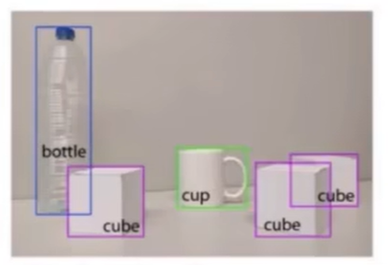
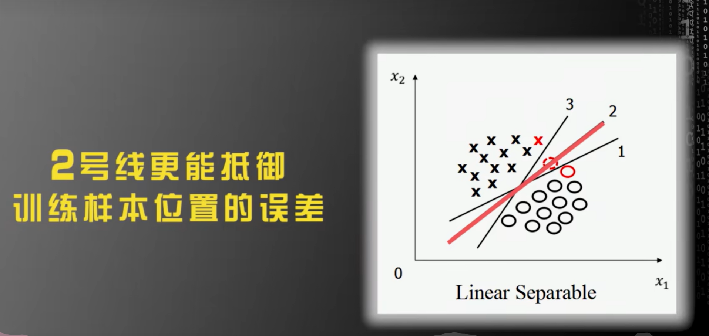

# 深度学习、目标检测

## 一、目标检测基础知识

### 1 目标检测问题定义

==目标检测==是在图片中对可变数量的目标进行==查找==和==分类==，即==目标位置定位==与==目标类别分类==

- 目标种类与数量问题
- 目标尺度问题
- 外在环境干扰问题


### 2 图像分类、目标分割、目标检测

==目标检测==：确定目标在给定图像中的位置，如目标定位，以及每个目标属于哪个类别，即目标分类



==图像分类==：对图像中特定对象的类别进行分类或预测的技术，该技术的主要目的是准确识别图像中的特征


==目标分割==：需要找到当前的目标所占的区域（==语义分割==：同一类目标所占区域，==实例分割==：不仅要区分不同**语义**层面上的目标，而且对于同一类别的目标，也要划分出不同的**实例**）

**传统的机器学习方法中会手动设置一些特征来完成特征提取，深度学习中通常通过卷积神经网络完成特征的抽取**。目标检测和图像分类都属于计算机视觉领域比较基础的应用


### 3 目标检测方法的变迁


### 4 目标检测算法的基本流程


#### 传统目标检测算法

- Viola-Jones（人脸检测）
- HOG+SVM
- DPM（==传统目标检测算法的巅峰之作==）


## 二、目标检测常见算法（一）- 传统目标检测算法篇

### 2.1 Viola-Jones（人脸检测）


#### 2.1.1  Haar 特征提取

##### 2.1.1.1 基本概念

Haar特征分为三类：==边缘特征==、==线性特征==、==中心特征和对角线特征==，它们组合成特征模板，**特征模板内有白色和黑色两种矩形**。并定义该模板的==特征值为白色矩形像素和减去黑色矩形像素和==。

Haar特征值反映了图像的灰度变化情况。例如：脸部的一些特征能由矩形特征简单的描述，如：眼睛要比脸颊颜色要深，鼻梁两侧比鼻梁颜色要深，嘴巴比周围颜色要深等。

但==矩形特征只对一些简单的图形结构，如边缘、线段较敏感==，所以只能描述特定走向（水平、垂直、对角）的结构。

##### 2.1.1.2 矩形特征分类


##### 2.1.1.3 提取特征

从上到下,从左到右


###### 2.1.1.3.1 滑动

存在某一图片,大小为100x100;Haar特征模板大小为10x10,步长为10，如果要提取图片所有Haar特征,需要滑动100次,即会产生100个Haar模板,这样就会计算100次特征


###### 2.1.1.3.2 缩放

在滑动遍历完成后会进行缩放遍历,模板会由10x10缩放为11x11,之后继续滑动遍历,直到模板缩放到20x20,缩放10次

事实上，矩形特征值是由==矩形模版类别==、==矩形位置==和==矩形大小==这三个因素的函数。因此当特征模板的大小和类别也发生变化的时候，一个图像得到的特征值的数量要暴增，一般的Haar特征计算过程即是如此，一张图像，经过不同的模板滑动，不同模板的不同大小的矩形的滑动，可以得到N个特征值，但是对于一般的Haar分类器来讲，特征计算只是一个小步骤，最终要经过某种算法比如==AdaBoost算法==来进行训练，以判别哪些矩形的特征是对分类器分类最有效的**，**通过计算Haar特征的特征值，可以有将图像矩阵映射为1维特征值，有效实现了降维

##### 2.1.1.4 计算特征

一张图像能够提取出多少个Haar-like特征？矩形特征可位于图像窗口的任意位置，其大小也可以任意改变，所以矩形特征值是矩**形模版类别**、**矩形位置**和**矩形大小**这三个因素的函数

以一个 24 × 24 的窗口为例，采用5种Haar-like特征进行计算


###### a 矩形特征图

该矩形特征的行高可以为1~24中的任意一个数，但列宽只能是2的倍数，即1-24中的偶数；行高与列宽两两组合：矩形模板的大小


以上只考虑了矩形模板的类别与大小，并没有考虑位置，假设矩形模板大小为：1 x 2，则它在 24 × 24 的图像窗口中有多少不同位置呢？行高为1，所以有24-**1**+1=24种可能；列宽为2，所以有24-**2**+1=23种可能，所以，该矩形模板有24 × 23 = 552 种不同的位置


$$
如果一个矩形模板的大小为 \quad x*y \quad 则可产生的特征数为
\\(W-x+1)*(H-y+1)
\\W为图像窗口的列宽，H为图像窗口的行高
\\x为矩形模板的列宽，h为矩形模板的行高
$$

###### b、c、d、e 特征图

- 假设矩形模板大小为：1 × 2，则该矩形模板有 24 × 23 = 552 种可能的位置
- 假设矩形模板大小为：1 × 4，则该矩形模板有 24 × 21 = 504 种可能的位置
- ......
- 假设矩形模板大小为：2 × 6，则该矩形模板有 23 × 19 = 437 种可能的位置.
- ......
- 假设矩形模板大小为：24 × 24，则该矩形模板有1 × 1 = 1 种可能的位置

通过程序计算可知 a、b、c、d、e 这五种特征模板的特征值数量分别为：43200，43200，27600，27600，20736，总计为160381. 就单单24 × 24 大小的图像窗口就有16万以上的特征值，这特征值数量有点多，计算量确实有点大

##### 2.1.1.5 积分图

图像是由一系列的离散像素点组成, 因此图像的积分其实就是求和。积分图又称总和面积. ==对于一幅灰度图==，积分图像中的==任意一点的值==是指==从原图像的左上角到这个点所构成的矩形区域内的所有点的灰度值之和==


###### 积分图计算原理

图像是由一系列的离散像素点组成, 因此图像的积分其实就是求和. 图像积分图中每个点的值是原图像中该点左上角的所有像素值之和，首先建立一个数组 A 作为积分图像，其宽高与原图像相等. 然后对这个数组赋值，每个点存储的是该点与图像原点所构成的矩形中所有像素的和
$$
SAT(x,y)=\sum_{i = 1,j = 1}^{i=x,j=y} (i,j)点的像素值
$$


#### 使用积分图==快速==的计算特征


#### 2.1.2 Adaboost 算法 根据特征训练分类器

##### 2.1.2.1 计算特征值

先选一种类型特征 ， 比如选模板 X2 ， 尺寸 6 * 6 ， 在图片位置 （ 4 ， 5 ） 求出的各个训练图片的 Haar-like 值为特征值 


##### 2.1.2.2 得到弱分类器函数

输入训练图片 （ 20000 张人脸 ， 40000 张非人脸 ， 尺寸 20 * 20 ） ． 这样的话每个训练图片都得到一个整数的特征值 。 为简单示例 ， 假设 3 张人脸 ， 3 张非人脸 。 得到值以后排序后如下 


对于这样的训练数据，我们选一个最简单的分类函数（Adaboost里叫作==弱分类器函数==）：

- 特征值小于等于某个==阈值t1==就认为是人脸，大于==阈值==就是非人脸
- 特征值小于等于某个==阈值t1==就认为是人非脸，大于==阈值==就是人脸

这里的t1一般选具体的某个特征值，是个常数；至于选小于等于还是大于等于就看这样选择后的==错误率哪个更低==，需要由输入训练数据后根据错误率来得到的值

###### 2.1.2.2.1 如何求 ==阈值t1==?

最初的弱分类器可能只是一个最基本的Haar-like特征，计算输入图像的Haar-like特征值，和最初的弱分类器的特征值比较，来判断输入图像是否为人脸，然而这个弱分类器太简陋了，可能不比随机判断的效果好

对弱分类器的孵化就是训练弱分类器为==最优分类器==，注意这是的最优==不是强分类器==，只是一个误差相对我稍低的弱分类器，训练弱分类器实际上是为分类器进行设置的过程，弱分类器的数学结构：
$$
\\
弱分类器
\\
h(x,f,p,\theta)=
\left\{ 
    \begin{array}{c}
        p(f_x)<\theta \quad \quad =1 \\ 
        其他   \quad \quad =0 \\ 
    \end{array}
\right.
\\
\\ f 为特征
\\ \theta 为阈值
\\ p指示控制不等号的方向
\\ x表一个检测子窗口
$$
最基本的弱分类器只包含一个Haar-like特征，也就是说决策树只有一层，被称为树桩(stump)，要比较输入图像的特征值和弱分类器特征，需要一个阈值，当输入图像的特征值大于该阈值时判定其为人脸

训练最优弱分类器的过程其实就是在==寻找合适的分类器阈值==，使该分类器对所有样本的判断误差最低

###### 2.1.2.2.2 第一轮迭代

因为这是第一轮迭代计算，上面的每个训练样本赋值初始化权重 w1 =（0.167, 0.167, 0.167, 0.167, 0.167, 0.167）也就是样本数量分之一为初始权值

$$
初始权值
\\
w_1=\frac{1}{6} = 1.167
$$


从表中数据我们知道t1可以=100、110、120、130、140、150

若按 t1=100，选x < =100方式比较好，此时错判2个，错误率e=2 * 0.167 = 0.334


若按 t1=110，选x < =110方式比较好，此时错判1个，错误率rate=1 * 0.167 = 0.167


若按 t1=120，选x < =120方式比较好，此时错判2个，错误率e=2 * 0.167 = 0.334

同理 t1=130，此时错判3个，错误率e=3 * 0.167 = 0.501

同理 t1=140，此时错判2个，错误率e=2 * 0.167 = 0.334

同理 t1=150，...

可见 ==t1=110时，选x < =110，错误率最小rate=0.167==，则 

$$
本次迭代的 \quad最优弱分类器函数 \quad 为
\\
y=f_{1}(x)=
\left\{ 
    \begin{array}{c}
        x<=110 \quad \quad =1 \\ 
        \quad x=其他   \quad \quad =-1 \\ 
    \end{array}
\right.
\\
\\
函数f1的权重
\\
f_{w1}=\frac{1}{2} \ln \frac{1-rate}{rate} =0.5 * ln((1 – 0.167) / 0.167) = 0.8047
$$

###### 2.1.2.2.3 第二轮迭代

###### 更新样本权重

在上一次迭代中我们选了 t1=110，测试样本中只有特征值是 140 的测试是误判的，其他都是正确，正确的样本是：100, 110, 120, 130, 150

因为上次迭代是第一次迭代，所以权重都是0.167，这次是第二次迭代，所以这次样本权重调整方式为：
$$
w_2=w_1*e^{-f_{w1}}=\frac{1}{6}*e^{-\frac{1}{2}ln\frac{1-rate}{rate}}=\frac{1}{6}*\frac{1}{\sqrt{5}} \approx 0.075
$$
x =140的样本，则样本权重调整为
$$
w2=w1 * e^{f_{w1}} = \frac{1}{6}*e^{\frac{1}{2}ln5}=\frac{1}{6}*5^{\frac{1}{2}}\approx 0.373
$$
新样本权重总和为
$$
0.075 * 5 + 0.373 = 0.748
$$
规一化后，

x = 100, 110, 120, 130, 150时，样本权重更新为：
$$
w2=\frac{0.075}{0.748} = 0.10
$$
x = 140时, 样本权重更新为：
$$
w2=\frac{0.373}{0.748} = 0.50
$$
调整后，新样本权重为
$$
(0.1, 0.1, 0.1, 0.1, 0.5, 0.1)
$$
本次迭代是求==t2==，方法同上。此时的函数又叫做弱分类器函数，求出t2后就得到了本次迭代的最优弱分类器函数
$$
弱分类器函数
\\
y=f_{2}(x)= 
\left\{ 
    \begin{array}{c}
        x<=t_2 \quad \quad =1 \\ 
        \quad x=其他   \quad \quad =-1 \\ 
    \end{array}
\right.
\\
或
\\
y=f_{2}(x)=
\left\{ 
    \begin{array}{c}
        x>=t_2 \quad \quad =1 \\ 
        \quad x=其他   \quad \quad =-1 \\ 
    \end{array}
\right.
$$
同理

若按t2=100分类。选x >= 100方式比较好，误判3个，错误率e=3*0.1 = 0.3


若按t2=110分类，选x>=110比较好，虽然误判4个，但此时错误率e=4*0.1 = 0.4

若按t2=120分类，选x>=120比较好，此时误判5个，错误率e=5*0.1 = 0.5

若按t2=130分类，选x>=130比较好，此时误判4个，错误率e=4*0.1 = 0.4

若按t2=140分类，选x<=140比价好，此时误判2个，错误率e=2 * 0.1 = 0.2

若按t2=150分类，选x<=150比价好，此时误判3个，错误率e=3 * 0.1 = 0.3

可见t2=140时，选x < =140错误率最小e=0.2，则本次迭代的最优弱分类器函数为
$$
本次迭代的最优弱分类器函数
\\
y=f_{2}(x)= 
\left\{ 
    \begin{array}{c}
        x<=140 \quad \quad =1 \\ 
        \quad x=其他   \quad \quad =-1 \\ 
    \end{array}
\right.
$$
这个函数f2的权重为
$$
函数f2的权重
\\
fw2=\frac{1}{2} \ln \frac{1-rate}{rate} = \frac{1}{2} * ln(\frac{1 –0.2}{0.2}) \approx 0.6931
$$

###### 2.1.2.2.4 第三轮迭代

先更新样本权重

由于 f2 里 t2=140 时，x = 100, 110, 150（第二轮权重为0.1）时，分类是正确，那么这几个样本权重调整为
$$
w3=w2 * e^{-fw2} =0.1 * e^{-0.6931} \approx 0.05
$$
x = 140时，分类正确，则样本权重为
$$
w3=w2 * e^{-fw2} =0.5 * e^{-0.6931} \approx 0.25
$$

###### 2 训练 x = 120, 130时，分类错误，则样本权重为：

$$
w3=w2 * exp(fw2) =0.1 * exp(0.6931) = 0.20
$$

新样本权重总和为 
$$
0.05 * 3 + 0.25 + 0.20 * 2 = 0.8
$$
规一化后，样本权重如下
$$
新样本权重=
\left\{ 
    \begin{array}{c}
        x=100,110,150 \quad \quad w3=\frac{0.05}{0.8} = 0.0625 \\ 
        x=140   \quad \quad w3=\frac{0.25}{0.8} = 0.3125 \\ 
        x=120,130 \quad \quad w3=\frac{0.20}{0.8}=0.250
    \end{array}
\right.
\\
\\
综上，新的样本权重为(0.0625, 0.0625, 0.250, 0.250, 0.3125, 0.0625)
$$
最优弱分类器
$$
y=f_{3}(x)= 
\left\{ 
\begin{array}{c}
x<=t_{3} \quad \quad =1 \\
x=其他 \quad \quad =-1
\end{array}
\right\} 
\\
或
\\
y=f_{3}(x)= 
\left\{ 
\begin{array}{c}
x>=t_{3} \quad \quad =1 \\
x=其他 \quad \quad =-1
\end{array}
\right\}
$$
最后得到

t3=140, 选 x>=140 方式，分类错误 3 个，但是错误率最小 rate=0.0625*3=0.1875，则
$$
本次迭代的最优弱分类器函数为
\\
y=f_{3}(x)= 
\left\{ 
\begin{array}{c}
x>=140 \quad \quad =1 \\
x=其他 \quad \quad =-1
\end{array}
\right\}
\\
\\
函数fw3的权重为
\\
fw3= \frac{1}{2} * ln(\frac{1 –0.1875}{0.1875}) \approx 0.7332
$$
这样不断迭代，就会产生==一系列的弱分类器函数==：

f{1}}(x), f{2}(x), f{3}(x), f{4}(x) ......

对应的权重：

fw1,fw2,fw3,fw4 ...... 

###### 2.1.2.2.5 迭代到什么时候结束呢？

- 第一种方式就是定一个最大迭代次数，比如迭代100次
- 第二种方式就是根据构造的强分类器函数的准确率，比如强分类器函数准确率已经到99%，错误率低于2%了，就停止迭代

##### 2.1.2.3 什么是强分类器函数？如何构造？

$$
强分类器函数
\\
G(x) =sign(fw1*f_{1} (x)+fw2*f_{2} (x)+fw3*f_{3} (x) ......)
$$

假如本次我们迭代3次结束了，那么强分类器函数就是
$$
本次的强分类器函数为
\\
G(x) =sign( 0.8047 * f1(x) + 0.6931 * f2(x) + 0.7332 * f3(x))
$$

##### 2.1.2.4 总结

以上是 Adaboost 通过训练==某一个类型特征==来得到了强分类器函数；前面说到就算一个 24*24 的图像对于 Harr 的 4 种模板都有 16 万种类型特征，有些类型特征迭代很少的次数就得到强分类器了，有些类型特征迭代没有得到强分类器

按照这样的迭代效果，挑选出一批满意的类型特征的强分类器函数，比如20个，求出它们各自的强分类器函数，然后把他们级联起来。假设我们选的强分类器的标准是识别率（人脸被正确识别的比率）=99%，误识率（非人脸被识别为人脸的比率）= 50%，那么20个强分类器级联后的总识别率为0.99^20=98%，错误接受率也仅为0.5^20 = 0.0001%。这样的效果就可以满足现实的需要了

具体操作如下图，我们输入一张待检测的图片，一般都比较大，然后对图片中进行多区域，多尺度的裁剪得到非常多的子窗口，把这些子窗口转成20*20后，如下图输入，先G1分类，如果pass，用G2分类...


### 2.2 HOG+SVM

> # 行人检测步骤
>
> 1. 提取 HOG 特征
> 2. 训练 SVM 分类器
> 3. 利用滑动窗口提取目标区域，进行分类判断
> 4. NMS
> 5. 输出检测结果
>
> 
>
> # 关键字概要
>
> HOG
>
> Histogram of Oriented Gradient：空间梯度方向直方图

#### 2.2.1 算法基本思路

将图像划分为很多小的连通区域，即细胞单元Cell，然后对Cell的梯度幅值和方向进行投票统计，形成基于梯度特性的直方图，把直方图在图像更大的范围内(又名区间或者Block)进行归一化

归一化的块描述符叫做HOG描述子，将检测窗口中的所有块的 HOG 描述子组合成最终的特征向量。然后使用 SVM 分类器进行目标和非目标的二分类（检测）

#### 2.2.2 HOG

梯度直方图 HOG 是法国人 Dalal 在2005年 CVPR 会议上提出的特征提取算法，并将其与 SVM 配合，用于行人检测，HOG特征在图像手工特征提取方面具有里程碑式的意义，当时在行人检测领域获得了极大成功

> 首先将图像分成小的连通区域，我们把它叫细胞单元==cell==，然后采集细胞单元中各像素点的==梯度的或边缘的方向直方图==。最后把这些直方图组合起来就可以构成特征描述器

##### 2.2.2.1 提取 HOG 特征流程

1. ==灰度化==+==Gamma 变换==（HOG 特征针对于灰度图，对于彩色图，需要先将彩色图转换为灰度图，Gamma变换 其实就是对像素值进行根号求解）
2. ==**计算**梯度 map==（会**计算每一个像素点在 x、y 两个方向上的梯度值**，并利用梯度值来计算梯度夹角，用 x 除以 y 得到 tan函数 值，利用 arctan函数 可以求出当前像素点的方向角，并将其量化，假如量化到 0-360 内的 18 个方向，那么 0-19 是第一个方向，20-39 是第二个方向，这样，每个像素点都会转换为一个 HOG 特征值）
3. 图像==划分成小的 cell，**统计**每个 cell 梯度直方图==（如果量化为 18 个方向，那么每个 cell 就是 18 维）
4. ==多个 cell 组成一个 block，特征归一化==（假如4个 cell 组成一个 block,那么一个 block 的特征值就是 4*(18维)注意，维度并没有发生变化，意义在于归一化）
5. ==多个 block 串联，并归一化==

> # win、block、cell
>
> 
>
> ==win== 当我们使用滑动窗口遍历方法实现目标检测任务时，首先我们需要构建一个滑动窗，这个滑动窗就是HOG的win；在HOG特征提取时，一个窗口是最小的特征提取单元，在特征检测任务中，滑动窗将以一个设定的步长在整个图像中顺序的滑动，每一次滑动后，都会提取窗口内的HOG特征，提取到的特征将送入到预先训练好的分类器中，如果分类器模型判定其为目标，则完成目标检测任务
>
> 进行窗口滑动时，我们依靠==检测窗口尺寸==，==窗口滑动步长==与==图像尺寸==共同决定将选择几个检测窗口，比如图像的尺寸为166×80，检测窗口的尺寸为64×64，窗口步长为(8,8)。那么在图像的列中将滑动次数如下
> $$
> nums_{cols} = \frac{166-64}{8} + 1 = 13.75 = 14
> \\
> nums_{rows} = \frac{80-64}{8} + 1 = 3
> \\
> 图像总滑动窗口个数 = nums_{cols} * nums_{rows} = 14 * 3 = 42
> $$
> ==block== **窗口内选择块**是一样的原理，假设给出块的尺寸为 16×16，块步长为 (8,8)，经过计算：检测窗口中共滑动 7×7=49个block
> $$
> nums_{cols} = \frac{64-16}{8} + 1 = 7
> \\
> nums_{rows} = \frac{64-16}{8} + 1 = 7
> \\
> 图像总滑动窗口个数 = nums_{cols} * nums_{rows} = 7 * 7 = 49
> $$
> ==cell== 8x8，每个 block 是由4个 cell 构成；本例中 cell 的中方向范围的个数由 bins 来决定（本例中为9），所以，一个cell中的向量为9个，因此在一个尺寸为64×64的检测窗中，描述子的维数就应该为 49 x 4 x 9=1764。其中4为一个block中cell的个数，49为一个win中block的个数

> # 流程详解
>
> ## 1 灰度化+Gamma 变换
>
> 为了减少光照因素的影响 ， 首先需要将整个图像进行规范化 （ 归一化 ） 。 在图像的纹理强度中 ， 局部的表层曝光贡献的比重较大 ， 所以 ， 这种压缩处理能够有效地降低图像局部的阴影和光照变化 。 因为颜色信息作用不大 ， 通常先转化为灰度图 
>
> ## 2 计算图像梯度
>
> 用以下公式来计算梯度的幅值和方向
>
> 梯度幅值凸显了像素值有剧烈变化的地方，在每个像素点，都有一个幅值和方向，对于有RGB图片，可以先经过灰度化和gamma校正（通过对比度修正使得杂物变少，其次使得亮度变化较大的图像归一化到亮度比较平均的水平下，以此来提高识别效率，减少漏检和误检）然后再来计算梯度，这样一来计算梯度的次数会明显减少
> $$
> 梯度值 \quad g = \sqrt{g_x^2 + g_y^2}
> \\
> 梯度方向 \quad \theta = arctan \frac{g_y}{g_z}
> $$
> 最常用的方法是用==[-1,0,1]==梯度算子对原图像做卷积运算，得到x方向（水平方向，以向右为正方向）的梯度分量gradscalx，然后用==[1,0,-1]T==梯度算子对原图像做卷积运算，得到y方向（竖直方向，以向上为正方向）的梯度分量gradscaly，然后再用以上公式计算该像素点的梯度大小和方向
>
> 
>
> ## 3 统计每个 cell 梯度直方图
>
> 我们将图像分成若干个==单元格cell==，例如每个cell为6*6个像素。假设我们采用9个bin的直方图来统计这6 x 6个像素的梯度信息，也就是将 cell 的梯度方向360度分成9个方向块，如果这个像素的==梯度方向==是20-40度，直方图第2个bin的计数就==加梯度权值==，这样，对cell内每个像素用梯度方向在直方图中进行加权投影（映射到固定的角度范围），就可以得到这个cell的梯度方向直方图了，就是该cell对应的9维特征向量（因为有9个bin），==梯度大小==作为投影权值，假如这个像素的梯度方向是20-40度，然后它的梯度大小是2，那么直方图第2个bin的计数就加二
>
> 
>
> **单个 cell (8 * 8) 内HOG的获取**
>
> 
>
> ==根据方向选择映射到哪个bin==, ==根据幅值来确定这个bin中的增量的权值的大小==
>
> 以蓝色圈圈出来的像素点为例，它的角度是80度，幅值是2，所以它直接在第5个bin里面加了2
>
> 再来看红色的圈圈出来的像素点，它的角度是10度，副值是4，因为角度10介于0-20度（0 x 0.5 + 20 x 0.5 = 10），所以把幅值的0.5加到第1个bin里面去，再把幅值的0.5倍加到第2个bin里面去（0.5是基于10到 0和20 的距离比重来判断的）
>
> ## 4 多个 cell 组成一个 block，特征归一化
>
> 由于局部光照的变化以及前景-背景对比度的变化，使得梯度强度的变化范围非常大。这就需要对梯度强度做归一化。归一化能够进一步地对光照、阴影和边缘进行压缩，把各个细胞单元组合成大的、空间上连通的区间（blocks），这样一个block内所有cell的特征向量串联起来便得到该**block的HOG特征**
>
> 这些区间是互有==重叠==（因为block步长不一定等于block边长）的，这就意味着每一个单元格的特征会以不同的结果多次出现在最后的特征向量中。我们将归一化之后的块描述符（向量）就称之为HOG描述符
>
> 每个区间中可以有三个参数来表示特征：==细胞单元的数目==、==每个细胞单元中像素点的数目==、==每个细胞的直方图通道数目==
>
> 例如：行人检测的最佳参数设置是：3×3细胞/区间、6×6像素/细胞、9个直方图通道
>
> ## 多个 block 串联，并归一化
>
> 最后一步就是将检测窗口中所有重叠的块进行HOG特征的收集，并将它们结合成最终的特征向量供分类使用

> # 总结
>
> Hog 特征提取的过程可大致理解为：将输入样本缩放为：64 x 128，把样本图像分割为 8 x 8 像素的单元（cellsize），把梯度方向平均划分为9个区间（bin），在每个单元里面对所有像素的梯度方向在各个方向区间进行直方图统计，得到一个9维的特征向量，每相邻的4个单元构成一个块（blocksize），把一个块内的特征向量联起来得到36维的特征向量，用块（blocksize）对样本图像进行扫描，扫描步长（blockstride）为一个单元（cellsize）。最后将所有块的特征串联起来，就得到了人体的特征
>
> 对于64x128的图像而言，每16x16的像素组成一个cell，每2x2个cellsize组成一个blocksize，因为每个cellsize有9个特征，所以每个块内有4 x 9 = 36个特征，以8个像素为步长（blockstride=（8，8）），那么，水平方向将有7个扫描窗口，垂直方向将有15个扫描窗口。也就是说，64x128的图片，总共有36 x 7 x 15 = 3780个特征
>
> 另外，Dalal提出的Hog特征提取过程中，直方图的方向bin在0度-180度(无符号梯度)或者0度-360度(有符号梯度)之间均分，增加bin的个数可以显著提高检测器的性能，直到大约9个bin为止，文中所用的是无符号梯度的0度-180度均分方向直方图。如果包括梯度符号信息(方向范围为0度-360度，类似SIFT描述子中使用的方向直方图)会导致性能下降，即使bin的个数加倍来保存原始方向信息也不行。对于人体检测来说，衣服和背景颜色的多变可能使得梯度符号信息无意义，但对于其他目标检测，例如汽车、摩托车，梯度符号信息是有用的
>
> 作者文中对于cellsize和blocksize的选择做了很多实验，首先是确定cellsize的尺寸，比如4 x 4， 6 x 6，8 x 8, 10 x 10等等，然后再确定一个block中含有多少个cell，例如：一个block中含有1 x 1，2 x 2 ，3 x 3还是4 x 4个cell。作者给出了在10^(-4)FPPW（每个窗口的误报率）时漏检率随不同的细胞单元和块尺寸的变化情况，如下图所示。对于人体检测，每个block内含3 x 3个cell，每个cell含6 x 6个像素时最优，此时漏检率大约为10.4%
>
> 

什么叫图像梯度

可以把图像看成二维离散函数，==图像梯度==其实==就是这个二维离散函数的求导==

基本思路是将图像划分为很多小的连通区域，即细胞单元Cell，然后对Cell的梯度幅值和方向进行投票统计，形成基于梯度特性的直方图。把直方图在图像更大的范围内(又名区间或者Block)进行归一化。归一化的块描述符叫做HOG描述子(feature descriptor)。将检测窗口中的所有块的HOG描述子组合成最终的特征向量。然后使用SVM分类器进行目标和非目标的二分类（检测）

##### 2.2.2.2 特征描述符

特征描述符就是通过提取图像的有用信息，并且丢弃无关信息来简化图像的表示。HOG特征描述符可以将3通道的彩色图像转换成一定长度的特征向量，在HOG特征描述符中，==梯度方向的分布，也就是梯度方向的直方图被视作特征==

图像的梯度(x和y导数)非常有用，因为边缘和拐角(强度突变的区域)周围的梯度幅度很大，并且边缘和拐角比平坦区域包含更多关于物体形状的信息；HOG算法的主要目的是对图像进行梯度计算，统计图像的==梯度方向==和==梯度大小==

它提取的边缘和梯度特征能够很好的抓住局部形状的特点，并且因为对图像做了 Gamma 校正和采用 cell 方式进行归一化处理， 对几何和光学变化都有很好的不变性，变换或旋转对于足够小的区域影响很小

##### 2.2.2.3 HOG 算法的优缺点

###### 优点

- 核心思想是所检测的局部物体外形能够被梯度或边缘方向的分布所描述，HOG能较好地捕捉局部形状信息，对几何和光学变化都有很好的不变性
- HOG是在密集采样的图像块中求取的，在计算得到的 HOG 特征向量中隐含了该块与检测窗口之间的空间位置关系

###### 缺点

- 特征描述子获取过程复杂，维数较高，导致实时性差

- 很难处理遮挡问题，人体姿势动作幅度过大或物体方向改变也不易检测（这个问题后来在DPM中采用可变形部件模型的方法得到了改善）

- 跟SIFT相比，HOG没有选取主方向，也没有旋转梯度方向直方图，因而本身不具有旋转不变性（较大的方向变化），其旋转不变性是通过采用不同旋转方向的训练样本来实现的

- 跟SIFT相比，HOG本身不具有尺度不变性，其尺度不变性是通过缩放检测窗口图像的大小来实现的

- 由于梯度的性质，HOG对噪点相当敏感，在实际应用中，在block和Cell划分之后，对于得到各个区域，有时候还会做一次高斯平滑去除噪点

#### 2.2.3 SVM 支持向量机

##### 2.2.3.1 SVM 概念

SVM是一类有监督的分类算法，它的大致思想是：假设样本空间上有两类点，我们希望找到一个划分超平面，将这两类样本分开，而划分超平面应该选择泛化能力最好的，也就是能使得两类样本中距离它最近的样本点距离最大。如图所示，中间那条加粗的超平面就是我们所求的最优划分超平面


##### 2.2.3.2 线性可分与线性不可分

###### 2.2.3.2.1 线性可分

这个训练样本集是线性可分的，是指存在一条直线，可以将练样本集（不同类别）分开

在特征空间是二维时，分割○，×为直线

在特征空间是三维时，分割○，×为平面

在特征空间是 大于等于四维时，分割○，×为超平面（Hyperplane）

由于人眼对空间的感知，仅仅局限于三维，所以我们无法直观的画图，在四维以及四维以上的情况，说明线性可分和线性不可分，此时我们借助数学知识进行划分


###### 2.2.3.2.2 线性不可分

不存在一条直线，能将训练样本集（不同类别）分开


2.2.3.2.3 用数学来定义线性可分/线性不可分


###### 2.2.3.2.3.1 用数学严格定义训练样本以及他们的标签

###### 定义法一

假设，我们有N个训练样本和他们的标签：
$$
\{(X_1, y_1), (X_2, y_2), (X_3, y_3),...,(X_n, y_n)\} \\ \\ X_i = [x_{i1}, x_{i2}]^T \\ Y_i = \{+1, -1\}
$$

```
	| x11 	x12 |
	| x21	x22	|
X = | x31	x32	|
	| ...		|
	| xi1	xi2	|
```

在  i = 1~N 线性可分，是指存在 (ω1, ω2, b) 使得对 i = 1~N，有如下关系
$$
若 y_i = +1，则 \omega_1x_{i1}+\omega_2x_{i2} + b > 0
\\
若 y_i = -1，则 \omega_1x_{i1}+\omega_2x_{i2} + b < 0
$$

###### 定义法二

假设
$$
X_i = \left[
\matrix{
  x_{i1}\\
  x_{i2}
}
\right]^T \quad

\omega = \left[
\matrix{
  \omega_1\\
  \omega_2
}
\right]^T
$$

$$
若 y_i = +1，则 \omega^Tx_i + b > 0
\\
若 y_i = -1，则 \omega^Tx_i + b < 0
$$

一个训练样本集 {(Xi, yi)}， 在 i = 1~N 线性可分，是指存在 (ω, b)，使得对 i = 1~N，有
$$
y_i(\omega^TX _i + b) > 0
$$

> 在**二分类**情况下，如果一个数据集是线性可分的，即存在一个超平面将两个类别完全分开，那么一定存在无数多个超平面将这两个类别完全分开

#### 2.2.3.3 解决线性可分问题

如果一个数据集是线性可分的，那么将存在无数多个超平面将各个类别所分开；那么，在这无数多个分开各个类别的超平面中，到底哪一个是==最好的==呢？

根据免费午餐定理，在没有假设训练数据先验分布的情况下，三条线的表现应该是一样的，但是为什么大多数人认为二号线的表现更好呢？




二号线是怎么画出来的？基于最优化理论

① 对于任意一条分开两类的直线，将其分别向两类方向平移，直到它擦到一个或几个训练样本为止


② 定义两条平行线擦到的训练样本叫做这个数据集的支持向量；两条平行线之间的距离叫作间隔


③ 我们想要求的直线便是间隔最大的那条直线


④ 使用间隔最大的准则并不能唯一的确定一条直线，例如下图


⑤ 为了确定唯一的结果，我们规定目标线在上下两个平行线的中间


所以，支持向量机寻找的最优分类直线应满足

- 该直线分开了两类
- 该直线最大化了间隔
- 该直线属于间隔的中间，到所有支持向量距离相等

### 2.3 DPM


#### 深度学习目标检测算法

One-stage（YOLO 和 SSD系列）：通过直接回归目标位置的策略来进行目标的检测和定位

Two-stage（Faster RCNN系列）：通过利用RPN网络对候选区域进行推荐

## 三、目标检测常见算法（二）- 深度学习目标检测算法篇

### 3.1 深度学习目标检测的方法


### 3.2 传统目标检测算法和深度学习目标检测算法的区别


### 3.3 目标检测算法的应用场景

- 人脸识别
- OCR文本识别
- 通用物体识别
- 行车检测

### 3.4 传统目标检测算法流程


