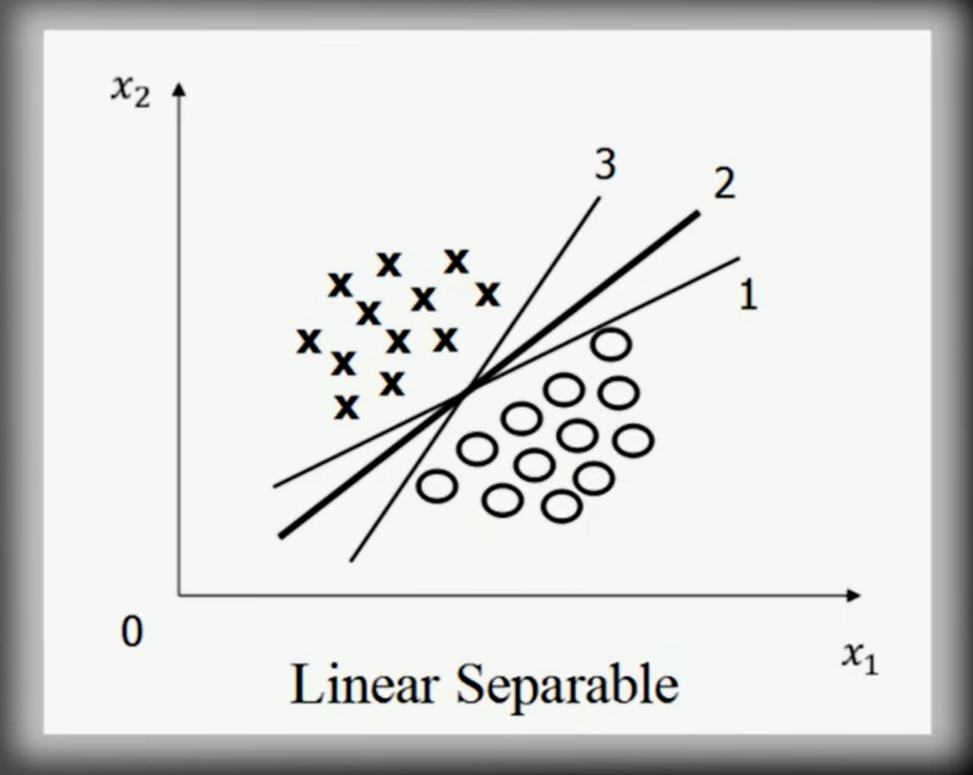
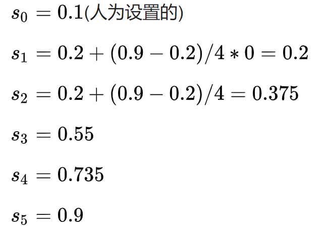

# 深度学习、目标检测

## 一、目标检测基础知识

### 1 目标检测问题定义

==目标检测==是在图片中对可变数量的目标进行==查找==和==分类==，即==目标位置定位==与==目标类别分类==

- 目标种类与数量问题
- 目标尺度问题
- 外在环境干扰问题


### 2 图像分类、目标分割、目标检测

==目标检测==：确定目标在给定图像中的位置，如目标定位，以及每个目标属于哪个类别，即目标分类


==图像分类==：对图像中特定对象的类别进行分类或预测的技术，该技术的主要目的是准确识别图像中的特征


==目标分割==：需要找到当前的目标所占的区域（==语义分割==：同一类目标所占区域，==实例分割==：不仅要区分不同**语义**层面上的目标，而且对于同一类别的目标，也要划分出不同的**实例**）

**传统的机器学习方法中会手动设置一些特征来完成特征提取，深度学习中通常通过卷积神经网络完成特征的抽取**。目标检测和图像分类都属于计算机视觉领域比较基础的应用


### 3 目标检测方法的变迁


### 4 目标检测算法的基本流程


#### 传统目标检测算法

- Viola-Jones（人脸检测）
- HOG+SVM
- DPM（==传统目标检测算法的巅峰之作==）


## 二、目标检测常见算法（一）- 传统目标检测算法篇

### 2.1 Viola-Jones（人脸检测）


#### 2.1.1  Haar 特征提取

##### 2.1.1.1 基本概念

Haar特征分为三类：==边缘特征==、==线性特征==、==中心特征和对角线特征==，它们组合成特征模板，**特征模板内有白色和黑色两种矩形**。并定义该模板的==特征值为白色矩形像素和减去黑色矩形像素和==。

Haar特征值反映了图像的灰度变化情况。例如：脸部的一些特征能由矩形特征简单的描述，如：眼睛要比脸颊颜色要深，鼻梁两侧比鼻梁颜色要深，嘴巴比周围颜色要深等。

但==矩形特征只对一些简单的图形结构，如边缘、线段较敏感==，所以只能描述特定走向（水平、垂直、对角）的结构。

##### 2.1.1.2 矩形特征分类


##### 2.1.1.3 提取特征

从上到下,从左到右


###### 2.1.1.3.1 滑动

存在某一图片,大小为100x100;Haar特征模板大小为10x10,步长为10，如果要提取图片所有Haar特征,需要滑动100次,即会产生100个Haar模板,这样就会计算100次特征


###### 2.1.1.3.2 缩放

在滑动遍历完成后会进行缩放遍历,模板会由10x10缩放为11x11,之后继续滑动遍历,直到模板缩放到20x20,缩放10次

事实上，矩形特征值是由==矩形模版类别==、==矩形位置==和==矩形大小==这三个因素的函数。因此当特征模板的大小和类别也发生变化的时候，一个图像得到的特征值的数量要暴增，一般的Haar特征计算过程即是如此，一张图像，经过不同的模板滑动，不同模板的不同大小的矩形的滑动，可以得到N个特征值，但是对于一般的Haar分类器来讲，特征计算只是一个小步骤，最终要经过某种算法比如==AdaBoost算法==来进行训练，以判别哪些矩形的特征是对分类器分类最有效的**，**通过计算Haar特征的特征值，可以有将图像矩阵映射为1维特征值，有效实现了降维

##### 2.1.1.4 计算特征

一张图像能够提取出多少个Haar-like特征？矩形特征可位于图像窗口的任意位置，其大小也可以任意改变，所以矩形特征值是矩**形模版类别**、**矩形位置**和**矩形大小**这三个因素的函数

以一个 24 × 24 的窗口为例，采用5种Haar-like特征进行计算


###### a 矩形特征图

该矩形特征的行高可以为1~24中的任意一个数，但列宽只能是2的倍数，即1-24中的偶数；行高与列宽两两组合：矩形模板的大小


以上只考虑了矩形模板的类别与大小，并没有考虑位置，假设矩形模板大小为：1 x 2，则它在 24 × 24 的图像窗口中有多少不同位置呢？行高为1，所以有24-**1**+1=24种可能；列宽为2，所以有24-**2**+1=23种可能，所以，该矩形模板有24 × 23 = 552 种不同的位置


$$
如果一个矩形模板的大小为 \quad x*y \quad 则可产生的特征数为
\\(W-x+1)*(H-y+1)
\\W为图像窗口的列宽，H为图像窗口的行高
\\x为矩形模板的列宽，h为矩形模板的行高
$$

###### b、c、d、e 特征图

- 假设矩形模板大小为：1 × 2，则该矩形模板有 24 × 23 = 552 种可能的位置
- 假设矩形模板大小为：1 × 4，则该矩形模板有 24 × 21 = 504 种可能的位置
- ......
- 假设矩形模板大小为：2 × 6，则该矩形模板有 23 × 19 = 437 种可能的位置.
- ......
- 假设矩形模板大小为：24 × 24，则该矩形模板有1 × 1 = 1 种可能的位置

通过程序计算可知 a、b、c、d、e 这五种特征模板的特征值数量分别为：43200，43200，27600，27600，20736，总计为160381. 就单单24 × 24 大小的图像窗口就有16万以上的特征值，这特征值数量有点多，计算量确实有点大

##### 2.1.1.5 积分图

图像是由一系列的离散像素点组成, 因此图像的积分其实就是求和。积分图又称总和面积. ==对于一幅灰度图==，积分图像中的==任意一点的值==是指==从原图像的左上角到这个点所构成的矩形区域内的所有点的灰度值之和==


###### 积分图计算原理

图像是由一系列的离散像素点组成, 因此图像的积分其实就是求和. 图像积分图中每个点的值是原图像中该点左上角的所有像素值之和，首先建立一个数组 A 作为积分图像，其宽高与原图像相等. 然后对这个数组赋值，每个点存储的是该点与图像原点所构成的矩形中所有像素的和
$$
SAT(x,y)=\sum_{i = 1,j = 1}^{i=x,j=y} (i,j)点的像素值
$$


#### 使用积分图==快速==的计算特征


#### 2.1.2 Adaboost 算法 根据特征训练分类器

##### 2.1.2.1 计算特征值

先选一种类型特征 ， 比如选模板 X2 ， 尺寸 6 * 6 ， 在图片位置 （ 4 ， 5 ） 求出的各个训练图片的 Haar-like 值为特征值 


##### 2.1.2.2 得到弱分类器函数

输入训练图片 （ 20000 张人脸 ， 40000 张非人脸 ， 尺寸 20 * 20 ） ． 这样的话每个训练图片都得到一个整数的特征值 。 为简单示例 ， 假设 3 张人脸 ， 3 张非人脸 。 得到值以后排序后如下 


对于这样的训练数据，我们选一个最简单的分类函数（Adaboost里叫作==弱分类器函数==）：

- 特征值小于等于某个==阈值t1==就认为是人脸，大于==阈值==就是非人脸
- 特征值小于等于某个==阈值t1==就认为是人非脸，大于==阈值==就是人脸

这里的t1一般选具体的某个特征值，是个常数；至于选小于等于还是大于等于就看这样选择后的==错误率哪个更低==，需要由输入训练数据后根据错误率来得到的值

###### 2.1.2.2.1 如何求 ==阈值t1==?

最初的弱分类器可能只是一个最基本的Haar-like特征，计算输入图像的Haar-like特征值，和最初的弱分类器的特征值比较，来判断输入图像是否为人脸，然而这个弱分类器太简陋了，可能不比随机判断的效果好

对弱分类器的孵化就是训练弱分类器为==最优分类器==，注意这是的最优==不是强分类器==，只是一个误差相对我稍低的弱分类器，训练弱分类器实际上是为分类器进行设置的过程，弱分类器的数学结构：
$$
\\
弱分类器
\\
h(x,f,p,\theta)=
\left\{ 
    \begin{array}{c}
        p(f_x)<\theta \quad \quad =1 \\ 
        其他   \quad \quad =0 \\ 
    \end{array}
\right.
\\
\\ f 为特征
\\ \theta 为阈值
\\ p指示控制不等号的方向
\\ x表一个检测子窗口
$$
最基本的弱分类器只包含一个Haar-like特征，也就是说决策树只有一层，被称为树桩(stump)，要比较输入图像的特征值和弱分类器特征，需要一个阈值，当输入图像的特征值大于该阈值时判定其为人脸

训练最优弱分类器的过程其实就是在==寻找合适的分类器阈值==，使该分类器对所有样本的判断误差最低

###### 2.1.2.2.2 第一轮迭代

因为这是第一轮迭代计算，上面的每个训练样本赋值初始化权重 w1 =（0.167, 0.167, 0.167, 0.167, 0.167, 0.167）也就是样本数量分之一为初始权值

$$
初始权值
\\
w_1=\frac{1}{6} = 1.167
$$


从表中数据我们知道t1可以=100、110、120、130、140、150

若按 t1=100，选x < =100方式比较好，此时错判2个，错误率e=2 * 0.167 = 0.334


若按 t1=110，选x < =110方式比较好，此时错判1个，错误率rate=1 * 0.167 = 0.167


若按 t1=120，选x < =120方式比较好，此时错判2个，错误率e=2 * 0.167 = 0.334

同理 t1=130，此时错判3个，错误率e=3 * 0.167 = 0.501

同理 t1=140，此时错判2个，错误率e=2 * 0.167 = 0.334

同理 t1=150，...

可见 ==t1=110时，选x < =110，错误率最小rate=0.167==，则 

$$
本次迭代的 \quad最优弱分类器函数 \quad 为
\\
y=f_{1}(x)=
\left\{ 
    \begin{array}{c}
        x<=110 \quad \quad =1 \\ 
        \quad x=其他   \quad \quad =-1 \\ 
    \end{array}
\right.
\\
\\
函数f1的权重
\\
f_{w1}=\frac{1}{2} \ln \frac{1-rate}{rate} =0.5 * ln((1 – 0.167) / 0.167) = 0.8047
$$

###### 2.1.2.2.3 第二轮迭代

###### 更新样本权重

在上一次迭代中我们选了 t1=110，测试样本中只有特征值是 140 的测试是误判的，其他都是正确，正确的样本是：100, 110, 120, 130, 150

因为上次迭代是第一次迭代，所以权重都是0.167，这次是第二次迭代，所以这次样本权重调整方式为：
$$
w_2=w_1*e^{-f_{w1}}=\frac{1}{6}*e^{-\frac{1}{2}ln\frac{1-rate}{rate}}=\frac{1}{6}*\frac{1}{\sqrt{5}} \approx 0.075
$$
x =140的样本，则样本权重调整为
$$
w2=w1 * e^{f_{w1}} = \frac{1}{6}*e^{\frac{1}{2}ln5}=\frac{1}{6}*5^{\frac{1}{2}}\approx 0.373
$$
新样本权重总和为
$$
0.075 * 5 + 0.373 = 0.748
$$
规一化后，

x = 100, 110, 120, 130, 150时，样本权重更新为：
$$
w2=\frac{0.075}{0.748} = 0.10
$$
x = 140时, 样本权重更新为：
$$
w2=\frac{0.373}{0.748} = 0.50
$$
调整后，新样本权重为
$$
(0.1, 0.1, 0.1, 0.1, 0.5, 0.1)
$$
本次迭代是求==t2==，方法同上。此时的函数又叫做弱分类器函数，求出t2后就得到了本次迭代的最优弱分类器函数
$$
弱分类器函数
\\
y=f_{2}(x)= 
\left\{ 
    \begin{array}{c}
        x<=t_2 \quad \quad =1 \\ 
        \quad x=其他   \quad \quad =-1 \\ 
    \end{array}
\right.
\\
或
\\
y=f_{2}(x)=
\left\{ 
    \begin{array}{c}
        x>=t_2 \quad \quad =1 \\ 
        \quad x=其他   \quad \quad =-1 \\ 
    \end{array}
\right.
$$
同理

若按t2=100分类。选x >= 100方式比较好，误判3个，错误率e=3*0.1 = 0.3


若按t2=110分类，选x>=110比较好，虽然误判4个，但此时错误率e=4*0.1 = 0.4

若按t2=120分类，选x>=120比较好，此时误判5个，错误率e=5*0.1 = 0.5

若按t2=130分类，选x>=130比较好，此时误判4个，错误率e=4*0.1 = 0.4

若按t2=140分类，选x<=140比价好，此时误判2个，错误率e=2 * 0.1 = 0.2

若按t2=150分类，选x<=150比价好，此时误判3个，错误率e=3 * 0.1 = 0.3

可见t2=140时，选x < =140错误率最小e=0.2，则本次迭代的最优弱分类器函数为
$$
本次迭代的最优弱分类器函数
\\
y=f_{2}(x)= 
\left\{ 
    \begin{array}{c}
        x<=140 \quad \quad =1 \\ 
        \quad x=其他   \quad \quad =-1 \\ 
    \end{array}
\right.
$$
这个函数f2的权重为
$$
函数f2的权重
\\
fw2=\frac{1}{2} \ln \frac{1-rate}{rate} = \frac{1}{2} * ln(\frac{1 –0.2}{0.2}) \approx 0.6931
$$

###### 2.1.2.2.4 第三轮迭代

先更新样本权重

由于 f2 里 t2=140 时，x = 100, 110, 150（第二轮权重为0.1）时，分类是正确，那么这几个样本权重调整为
$$
w3=w2 * e^{-fw2} =0.1 * e^{-0.6931} \approx 0.05
$$
x = 140时，分类正确，则样本权重为
$$
w3=w2 * e^{-fw2} =0.5 * e^{-0.6931} \approx 0.25
$$

###### 2 训练 x = 120, 130时，分类错误，则样本权重为：

$$
w3=w2 * exp(fw2) =0.1 * exp(0.6931) = 0.20
$$

新样本权重总和为 
$$
0.05 * 3 + 0.25 + 0.20 * 2 = 0.8
$$
规一化后，样本权重如下
$$
新样本权重=
\left\{ 
    \begin{array}{c}
        x=100,110,150 \quad \quad w3=\frac{0.05}{0.8} = 0.0625 \\ 
        x=140   \quad \quad w3=\frac{0.25}{0.8} = 0.3125 \\ 
        x=120,130 \quad \quad w3=\frac{0.20}{0.8}=0.250
    \end{array}
\right.
\\
\\
综上，新的样本权重为(0.0625, 0.0625, 0.250, 0.250, 0.3125, 0.0625)
$$
最优弱分类器
$$
y=f_{3}(x)= 
\left\{ 
\begin{array}{c}
x<=t_{3} \quad \quad =1 \\
x=其他 \quad \quad =-1
\end{array}
\right\} 
\\
或
\\
y=f_{3}(x)= 
\left\{ 
\begin{array}{c}
x>=t_{3} \quad \quad =1 \\
x=其他 \quad \quad =-1
\end{array}
\right\}
$$
最后得到

t3=140, 选 x>=140 方式，分类错误 3 个，但是错误率最小 rate=0.0625*3=0.1875，则
$$
本次迭代的最优弱分类器函数为
\\
y=f_{3}(x)= 
\left\{ 
\begin{array}{c}
x>=140 \quad \quad =1 \\
x=其他 \quad \quad =-1
\end{array}
\right\}
\\
\\
函数fw3的权重为
\\
fw3= \frac{1}{2} * ln(\frac{1 –0.1875}{0.1875}) \approx 0.7332
$$
这样不断迭代，就会产生==一系列的弱分类器函数==：

f{1}}(x), f{2}(x), f{3}(x), f{4}(x) ......

对应的权重：

fw1,fw2,fw3,fw4 ...... 

###### 2.1.2.2.5 迭代到什么时候结束呢？

- 第一种方式就是定一个最大迭代次数，比如迭代100次
- 第二种方式就是根据构造的强分类器函数的准确率，比如强分类器函数准确率已经到99%，错误率低于2%了，就停止迭代

##### 2.1.2.3 什么是强分类器函数？如何构造？

$$
强分类器函数
\\
G(x) =sign(fw1*f_{1} (x)+fw2*f_{2} (x)+fw3*f_{3} (x) ......)
$$

假如本次我们迭代3次结束了，那么强分类器函数就是
$$
本次的强分类器函数为
\\
G(x) =sign( 0.8047 * f1(x) + 0.6931 * f2(x) + 0.7332 * f3(x))
$$

##### 2.1.2.4 总结

以上是 Adaboost 通过训练==某一个类型特征==来得到了强分类器函数；前面说到就算一个 24*24 的图像对于 Harr 的 4 种模板都有 16 万种类型特征，有些类型特征迭代很少的次数就得到强分类器了，有些类型特征迭代没有得到强分类器

按照这样的迭代效果，挑选出一批满意的类型特征的强分类器函数，比如20个，求出它们各自的强分类器函数，然后把他们级联起来。假设我们选的强分类器的标准是识别率（人脸被正确识别的比率）=99%，误识率（非人脸被识别为人脸的比率）= 50%，那么20个强分类器级联后的总识别率为0.99^20=98%，错误接受率也仅为0.5^20 = 0.0001%。这样的效果就可以满足现实的需要了

具体操作如下图，我们输入一张待检测的图片，一般都比较大，然后对图片中进行多区域，多尺度的裁剪得到非常多的子窗口，把这些子窗口转成20*20后，如下图输入，先G1分类，如果pass，用G2分类...


### 2.2 HOG+SVM

> # 行人检测步骤
>
> 1. 提取 HOG 特征
> 2. 训练 SVM 分类器
> 3. 利用滑动窗口提取目标区域，进行分类判断
> 4. NMS
> 5. 输出检测结果
>
> 
>
> # 关键字概要
>
> HOG
>
> Histogram of Oriented Gradient：空间梯度方向直方图

#### 2.2.1 算法基本思路

将图像划分为很多小的连通区域，即细胞单元Cell，然后对Cell的梯度幅值和方向进行投票统计，形成基于梯度特性的直方图，把直方图在图像更大的范围内(又名区间或者Block)进行归一化

归一化的块描述符叫做HOG描述子，将检测窗口中的所有块的 HOG 描述子组合成最终的特征向量。然后使用 SVM 分类器进行目标和非目标的二分类（检测）

#### 2.2.2 HOG

梯度直方图 HOG 是法国人 Dalal 在2005年 CVPR 会议上提出的特征提取算法，并将其与 SVM 配合，用于行人检测，HOG特征在图像手工特征提取方面具有里程碑式的意义，当时在行人检测领域获得了极大成功

> 首先将图像分成小的连通区域，我们把它叫细胞单元==cell==，然后采集细胞单元中各像素点的==梯度的或边缘的方向直方图==。最后把这些直方图组合起来就可以构成特征描述器

##### 2.2.2.1 提取 HOG 特征流程

1. ==灰度化==+==Gamma 变换==（HOG 特征针对于灰度图，对于彩色图，需要先将彩色图转换为灰度图，Gamma变换 其实就是对像素值进行根号求解）
2. ==**计算**梯度 map==（会**计算每一个像素点在 x、y 两个方向上的梯度值**，并利用梯度值来计算梯度夹角，用 x 除以 y 得到 tan函数 值，利用 arctan函数 可以求出当前像素点的方向角，并将其量化，假如量化到 0-360 内的 18 个方向，那么 0-19 是第一个方向，20-39 是第二个方向，这样，每个像素点都会转换为一个 HOG 特征值）
3. 图像==划分成小的 cell，**统计**每个 cell 梯度直方图==（如果量化为 18 个方向，那么每个 cell 就是 18 维）
4. ==多个 cell 组成一个 block，特征归一化==（假如4个 cell 组成一个 block,那么一个 block 的特征值就是 4*(18维)注意，维度并没有发生变化，意义在于归一化）
5. ==多个 block 串联，并归一化==

> # win、block、cell
>
> 
>
> ==win== 当我们使用滑动窗口遍历方法实现目标检测任务时，首先我们需要构建一个滑动窗，这个滑动窗就是HOG的win；在HOG特征提取时，一个窗口是最小的特征提取单元，在特征检测任务中，滑动窗将以一个设定的步长在整个图像中顺序的滑动，每一次滑动后，都会提取窗口内的HOG特征，提取到的特征将送入到预先训练好的分类器中，如果分类器模型判定其为目标，则完成目标检测任务
>
> 进行窗口滑动时，我们依靠==检测窗口尺寸==，==窗口滑动步长==与==图像尺寸==共同决定将选择几个检测窗口，比如图像的尺寸为166×80，检测窗口的尺寸为64×64，窗口步长为(8,8)。那么在图像的列中将滑动次数如下
> $$
> nums_{cols} = \frac{166-64}{8} + 1 = 13.75 = 14
> \\
> nums_{rows} = \frac{80-64}{8} + 1 = 3
> \\
> 图像总滑动窗口个数 = nums_{cols} * nums_{rows} = 14 * 3 = 42
> $$
> ==block== **窗口内选择块**是一样的原理，假设给出块的尺寸为 16×16，块步长为 (8,8)，经过计算：检测窗口中共滑动 7×7=49个block
> $$
> nums_{cols} = \frac{64-16}{8} + 1 = 7
> \\
> nums_{rows} = \frac{64-16}{8} + 1 = 7
> \\
> 图像总滑动窗口个数 = nums_{cols} * nums_{rows} = 7 * 7 = 49
> $$
> ==cell== 8x8，每个 block 是由4个 cell 构成；本例中 cell 的中方向范围的个数由 bins 来决定（本例中为9），所以，一个cell中的向量为9个，因此在一个尺寸为64×64的检测窗中，描述子的维数就应该为 49 x 4 x 9=1764。其中4为一个block中cell的个数，49为一个win中block的个数

> # 流程详解
>
> ## 1 灰度化+Gamma 变换
>
> 为了减少光照因素的影响 ， 首先需要将整个图像进行规范化 （ 归一化 ） 。 在图像的纹理强度中 ， 局部的表层曝光贡献的比重较大 ， 所以 ， 这种压缩处理能够有效地降低图像局部的阴影和光照变化 。 因为颜色信息作用不大 ， 通常先转化为灰度图 
>
> ## 2 计算图像梯度
>
> 用以下公式来计算梯度的幅值和方向
>
> 梯度幅值凸显了像素值有剧烈变化的地方，在每个像素点，都有一个幅值和方向，对于有RGB图片，可以先经过灰度化和gamma校正（通过对比度修正使得杂物变少，其次使得亮度变化较大的图像归一化到亮度比较平均的水平下，以此来提高识别效率，减少漏检和误检）然后再来计算梯度，这样一来计算梯度的次数会明显减少
> $$
> 梯度值 \quad g = \sqrt{g_x^2 + g_y^2}
> \\
> 梯度方向 \quad \theta = arctan \frac{g_y}{g_z}
> $$
> 最常用的方法是用==[-1,0,1]==梯度算子对原图像做卷积运算，得到x方向（水平方向，以向右为正方向）的梯度分量gradscalx，然后用==[1,0,-1]T==梯度算子对原图像做卷积运算，得到y方向（竖直方向，以向上为正方向）的梯度分量gradscaly，然后再用以上公式计算该像素点的梯度大小和方向
>
> 
>
> ## 3 统计每个 cell 梯度直方图
>
> 我们将图像分成若干个==单元格cell==，例如每个cell为6*6个像素。假设我们采用9个bin的直方图来统计这6 x 6个像素的梯度信息，也就是将 cell 的梯度方向360度分成9个方向块，如果这个像素的==梯度方向==是20-40度，直方图第2个bin的计数就==加梯度权值==，这样，对cell内每个像素用梯度方向在直方图中进行加权投影（映射到固定的角度范围），就可以得到这个cell的梯度方向直方图了，就是该cell对应的9维特征向量（因为有9个bin），==梯度大小==作为投影权值，假如这个像素的梯度方向是20-40度，然后它的梯度大小是2，那么直方图第2个bin的计数就加二
>
> 
>
> **单个 cell (8 * 8) 内HOG的获取**
>
> 
>
> ==根据方向选择映射到哪个bin==, ==根据幅值来确定这个bin中的增量的权值的大小==
>
> 以蓝色圈圈出来的像素点为例，它的角度是80度，幅值是2，所以它直接在第5个bin里面加了2
>
> 再来看红色的圈圈出来的像素点，它的角度是10度，副值是4，因为角度10介于0-20度（0 x 0.5 + 20 x 0.5 = 10），所以把幅值的0.5加到第1个bin里面去，再把幅值的0.5倍加到第2个bin里面去（0.5是基于10到 0和20 的距离比重来判断的）
>
> ## 4 多个 cell 组成一个 block，特征归一化
>
> 由于局部光照的变化以及前景-背景对比度的变化，使得梯度强度的变化范围非常大。这就需要对梯度强度做归一化。归一化能够进一步地对光照、阴影和边缘进行压缩，把各个细胞单元组合成大的、空间上连通的区间（blocks），这样一个block内所有cell的特征向量串联起来便得到该**block的HOG特征**
>
> 这些区间是互有==重叠==（因为block步长不一定等于block边长）的，这就意味着每一个单元格的特征会以不同的结果多次出现在最后的特征向量中。我们将归一化之后的块描述符（向量）就称之为HOG描述符
>
> 每个区间中可以有三个参数来表示特征：==细胞单元的数目==、==每个细胞单元中像素点的数目==、==每个细胞的直方图通道数目==
>
> 例如：行人检测的最佳参数设置是：3×3细胞/区间、6×6像素/细胞、9个直方图通道
>
> ## 多个 block 串联，并归一化
>
> 最后一步就是将检测窗口中所有重叠的块进行HOG特征的收集，并将它们结合成最终的特征向量供分类使用

> # 总结
>
> Hog 特征提取的过程可大致理解为：将输入样本缩放为：64 x 128，把样本图像分割为 8 x 8 像素的单元（cellsize），把梯度方向平均划分为9个区间（bin），在每个单元里面对所有像素的梯度方向在各个方向区间进行直方图统计，得到一个9维的特征向量，每相邻的4个单元构成一个块（blocksize），把一个块内的特征向量联起来得到36维的特征向量，用块（blocksize）对样本图像进行扫描，扫描步长（blockstride）为一个单元（cellsize）。最后将所有块的特征串联起来，就得到了人体的特征
>
> 对于64x128的图像而言，每16x16的像素组成一个cell，每2x2个cellsize组成一个blocksize，因为每个cellsize有9个特征，所以每个块内有4 x 9 = 36个特征，以8个像素为步长（blockstride=（8，8）），那么，水平方向将有7个扫描窗口，垂直方向将有15个扫描窗口。也就是说，64x128的图片，总共有36 x 7 x 15 = 3780个特征
>
> 另外，Dalal提出的Hog特征提取过程中，直方图的方向bin在0度-180度(无符号梯度)或者0度-360度(有符号梯度)之间均分，增加bin的个数可以显著提高检测器的性能，直到大约9个bin为止，文中所用的是无符号梯度的0度-180度均分方向直方图。如果包括梯度符号信息(方向范围为0度-360度，类似SIFT描述子中使用的方向直方图)会导致性能下降，即使bin的个数加倍来保存原始方向信息也不行。对于人体检测来说，衣服和背景颜色的多变可能使得梯度符号信息无意义，但对于其他目标检测，例如汽车、摩托车，梯度符号信息是有用的
>
> 作者文中对于cellsize和blocksize的选择做了很多实验，首先是确定cellsize的尺寸，比如4 x 4， 6 x 6，8 x 8, 10 x 10等等，然后再确定一个block中含有多少个cell，例如：一个block中含有1 x 1，2 x 2 ，3 x 3还是4 x 4个cell。作者给出了在10^(-4)FPPW（每个窗口的误报率）时漏检率随不同的细胞单元和块尺寸的变化情况，如下图所示。对于人体检测，每个block内含3 x 3个cell，每个cell含6 x 6个像素时最优，此时漏检率大约为10.4%
>
> 

什么叫图像梯度

可以把图像看成二维离散函数，==图像梯度==其实==就是这个二维离散函数的求导==

基本思路是将图像划分为很多小的连通区域，即细胞单元Cell，然后对Cell的梯度幅值和方向进行投票统计，形成基于梯度特性的直方图。把直方图在图像更大的范围内(又名区间或者Block)进行归一化。归一化的块描述符叫做HOG描述子(feature descriptor)。将检测窗口中的所有块的HOG描述子组合成最终的特征向量。然后使用SVM分类器进行目标和非目标的二分类（检测）

##### 2.2.2.2 特征描述符

特征描述符就是通过提取图像的有用信息，并且丢弃无关信息来简化图像的表示。HOG特征描述符可以将3通道的彩色图像转换成一定长度的特征向量，在HOG特征描述符中，==梯度方向的分布，也就是梯度方向的直方图被视作特征==

图像的梯度(x和y导数)非常有用，因为边缘和拐角(强度突变的区域)周围的梯度幅度很大，并且边缘和拐角比平坦区域包含更多关于物体形状的信息；HOG算法的主要目的是对图像进行梯度计算，统计图像的==梯度方向==和==梯度大小==

它提取的边缘和梯度特征能够很好的抓住局部形状的特点，并且因为对图像做了 Gamma 校正和采用 cell 方式进行归一化处理， 对几何和光学变化都有很好的不变性，变换或旋转对于足够小的区域影响很小

##### 2.2.2.3 HOG 算法的优缺点

###### 优点

- 核心思想是所检测的局部物体外形能够被梯度或边缘方向的分布所描述，HOG能较好地捕捉局部形状信息，对几何和光学变化都有很好的不变性
- HOG是在密集采样的图像块中求取的，在计算得到的 HOG 特征向量中隐含了该块与检测窗口之间的空间位置关系

###### 缺点

- 特征描述子获取过程复杂，维数较高，导致实时性差

- 很难处理遮挡问题，人体姿势动作幅度过大或物体方向改变也不易检测（这个问题后来在DPM中采用可变形部件模型的方法得到了改善）

- 跟SIFT相比，HOG没有选取主方向，也没有旋转梯度方向直方图，因而本身不具有旋转不变性（较大的方向变化），其旋转不变性是通过采用不同旋转方向的训练样本来实现的

- 跟SIFT相比，HOG本身不具有尺度不变性，其尺度不变性是通过缩放检测窗口图像的大小来实现的

- 由于梯度的性质，HOG对噪点相当敏感，在实际应用中，在block和Cell划分之后，对于得到各个区域，有时候还会做一次高斯平滑去除噪点

#### 2.2.3 SVM 支持向量机

##### 2.2.3.1 SVM 概念

SVM是一类有监督的分类算法，它的大致思想是：假设样本空间上有两类点，我们希望找到一个划分超平面，将这两类样本分开，而划分超平面应该选择泛化能力最好的，也就是能使得两类样本中距离它最近的样本点距离最大。如图所示，中间那条加粗的超平面就是我们所求的最优划分超平面


##### 2.2.3.2 线性可分与线性不可分

###### 2.2.3.2.1 线性可分

这个训练样本集是线性可分的，是指存在一条直线，可以将练样本集（不同类别）分开

在特征空间是二维时，分割○，×为直线

在特征空间是三维时，分割○，×为平面

在特征空间是 大于等于四维时，分割○，×为超平面（Hyperplane）

由于人眼对空间的感知，仅仅局限于三维，所以我们无法直观的画图，在四维以及四维以上的情况，说明线性可分和线性不可分，此时我们借助数学知识进行划分


###### 2.2.3.2.2 线性不可分

不存在一条直线，能将训练样本集（不同类别）分开


2.2.3.2.3 用数学来定义线性可分/线性不可分


###### 2.2.3.2.3.1 用数学严格定义训练样本以及他们的标签

###### 定义法一

假设，我们有N个训练样本和他们的标签：
$$
\{(X_1, y_1), (X_2, y_2), (X_3, y_3),...,(X_n, y_n)\} \\ \\ X_i = [x_{i1}, x_{i2}]^T \\ Y_i = \{+1, -1\}
$$

```
	| x11 	x12 |
	| x21	x22	|
X = | x31	x32	|
	| ...		|
	| xi1	xi2	|
```

在  i = 1~N 线性可分，是指存在 (ω1, ω2, b) 使得对 i = 1~N，有如下关系
$$
若 y_i = +1，则 \omega_1x_{i1}+\omega_2x_{i2} + b > 0
\\
若 y_i = -1，则 \omega_1x_{i1}+\omega_2x_{i2} + b < 0
$$

###### 定义法二

假设
$$
X_i = \left[
\matrix{
  x_{i1}\\
  x_{i2}
}
\right]^T \quad

\omega = \left[
\matrix{
  \omega_1\\
  \omega_2
}
\right]^T
$$

$$
若 y_i = +1，则 \omega^Tx_i + b > 0
\\
若 y_i = -1，则 \omega^Tx_i + b < 0
$$

一个训练样本集 {(Xi, yi)}， 在 i = 1~N 线性可分，是指存在 (ω, b)，使得对 i = 1~N，有
$$
y_i(\omega^TX _i + b) > 0
$$

> 在**二分类**情况下，如果一个数据集是线性可分的，即存在一个超平面将两个类别完全分开，那么一定存在无数多个超平面将这两个类别完全分开

#### 2.2.3.3 解决线性可分问题

如果一个数据集是线性可分的，那么将存在无数多个超平面将各个类别所分开；那么，在这无数多个分开各个类别的超平面中，到底哪一个是==最好的==呢？

根据免费午餐定理，在没有假设训练数据先验分布的情况下，三条线的表现应该是一样的，但是为什么大多数人认为二号线的表现更好呢？




二号线是怎么画出来的？基于最优化理论

① 对于任意一条分开两类的直线，将其分别向两类方向平移，直到它擦到一个或几个训练样本为止


② 定义两条平行线擦到的训练样本叫做这个数据集的支持向量；两条平行线之间的距离叫作间隔


③ 我们想要求的直线便是间隔最大的那条直线


④ 使用间隔最大的准则并不能唯一的确定一条直线，例如下图


⑤ 为了确定唯一的结果，我们规定目标线在上下两个平行线的中间


所以，支持向量机寻找的最优分类直线应满足

- 该直线分开了两类
- 该直线最大化了间隔
- 该直线属于间隔的中间，到所有支持向量距离相等

### 2.3 DPM

#### 2.3.1 概述

可变形组件模型，是一种基于组件的检测算法

该算法采用了==改进后的HOG特征==，==SVM分类器==和==滑动窗口==检测思想。它结合了**部件模型**和**形变模型**，通常应用于物体检测任务中

> HOG有一个缺点，很难处理遮挡问题，人体==姿势==动作幅度过大或物体==方向==改变也不易检测

##### 2.3.1.1 部件模型

将目标物体划分为不同的部件，并对每个部件建模

部件模型可以理解为由多个部件组成的目标模型，每个部件具有自己的特征和位置。通常部件模型由==一个主体部件==和==若干附属部件==组成。DPM部件模型在训练阶段通过学习目标的外观模型和位置约束来构建。==外观模型==可以是特征描述符或特征向量，用于表示部件的外观特征。==位置约束==定义了部件之间的相对位置关系

DPM算法使用部件模型来对输入图像进行**目标检测**和**姿态估计**。它通过在图像中搜索可能的部件位置和尺度，然后使用部件模型来对目标进行匹配和定位。通常，DPM算法会使用**滑动窗口**的方法在不同位置和尺度上对图像进行检测，然后使用部件模型对每个候选窗口进行**评分**，最终**选择得分最高的窗口**作为检测结果

##### 2.3.1.2 形变模型

用于描述目标形变的一种模型

在目标检测和姿态估计任务中，目标对象通常存在各种形变，例如目标的==旋转==、==尺度变化==、==形状变化==等。为了能够准确地检测和估计这些具有形变的目标，DPM算法引入了形变模型

形变模型是通过学习目标对象的**形变特征**来建模的。它描述了目标对象在不同形变情况下的变化规律。在DPM算法中，形变模型通常**基于==部件模型==进行建模**，**每个部件都有其形变模型**，用于描述部件在不同形变下的变化。DPM算法可以学习到目标对象在各种形变情况下的形变模式。这包括目标的旋转、尺度变化、形状变化等

在==测试阶段==，形变模型用于==对输入图像==中的目标==进行形变匹配和校正==。通过对候选目标区域应用形变模型，DPM算法可以将目标对象恢复到正常形状，并进行准确的检测和姿态估计

#### 2.3.2 大致步骤

1. 数据准备，收集用于训练和测试的目标检测数据集，==每个样本==应==包含==目标的==标注框==和相应的==部分标注==
2. 特征提取，提取每个样本的==梯度方向直方图==特征
3. 训练部分分类器，使用训练数据集和提取的特征，==训练每个目标部分的分类器==，每个部分的分类器负责**判断该部分是否存在于图像中**
4. 训练整体分类器，将所有部分的分类器==组合成整体分类器==，整体分类器综合考虑了目标的所有部分，用于**判断整个目标是否存在于图像中**
5. 创建图像金字塔，对于测试图像，生成一系列==尺度不同==的**图像金字塔**。金字塔中的每个尺度都用于检测目标
6. 滑动窗口检测，在==每个尺度==的**图像金字塔**上，使用滑动窗口的方式对图像进行检测。滑动窗口可以在图像的不同位置和尺度上移动，对每个位置和尺度进行目标检测
7. 目标部分的检测，对于每个滑动窗口，使用==部分分类器==对==目标的各个部分==进行检测。通过对部分的检测，可以更准确地确定目标的位置和姿态
8. 整体目标的检测，根据各个部分的检测结果，使用==整体分类器==对目标进行==最终的检测==。整体分类器综合考虑了各个部分的位置和姿态信息
9. 非极大值抑制，由于**滑动窗口会导致多个==重叠==的检测结果**，需要应用非极大值抑制来==去除冗余==的检测框，只保留最具有代表性的目标框
10. 输出结果，最后，输出目标检测的结果，即检测到的==目标框==及其对应的==置信度==

#### 2.3.3 具体过程

DPM 首先采用的是改进的 HOG 进行特征的提取，DPM 中==只保留了 HOG==中的 Cell，==取消了 Block==


一个 8x8 的 cell ，将该细胞单元与其相邻的4个 cell 单元做==归一化==操作

提取有符号的HOG梯度，0-360度将产生18个梯度向量

提取无符号的HOG梯度，0-180度将产生9个梯度向量

因此，一个 8x8 的 cell 单元将会产生 (18+9)x4=108 个特征，维度有点高，Felzenszwalb 优化为只提取无符号的 HOG 梯度，将会产生 4x9=36 维特征，将其看成一个4x9的矩阵

下图是36个主成分，前 12个 横条和竖条状的特征向量占据大部分，所以分别按行和按列求和，一共得到 4+9=13 维特征向量


分别将行和列分别相加，最终将生成4+9===13个特征向量==，为了进一步提高精度，将提取的==18维有符号的梯度特征==也加进来，这样，一共产生 13+18=31 维梯度特征，实现了很好的目标检测(达到PCA降维相似的效果)


对于任意一张输入图像，提取其DPM特征图，然后将原始图像进行高斯金字塔上采样，然后提取其DPM特征图。对于原始图像的DPM特征图和训练好的Root filter做卷积操作，从而得到==Root filter的响应图==

对于==2倍图像==的DPM特征图，和训练好的Part filter做卷积操作，从而得到==Part filter的响应图==。然后对其精细高斯金字塔的==下采样==操作

这样Root filter的响应图和Part filter的响应图就具有==相同分辨率==了。然后将其进行==加权平均==，得到最终的响应图。亮度越大表示响应值越大

> ##### 前置知识
>
> **上采样**
>
> 上采样是将图像的尺寸增大，即增加图像的分辨率。这通常通过插值操作来实现
>
> 上采样的目的是将低分辨率的图像==放大==到更高分辨率的尺寸，以便更好地检测和表示目标的细节
>
> 在DPM算法中，上采样常常用于构建==图像金字塔==。图像金字塔是通过在不同尺度下对图像进行上采样和下采样来实现的。上采样操作可以将原始图像放大到多个尺度，从而能够检测更小尺寸的目标部件或细节
>
> **下采样**
>
> 下采样是将图像的尺寸减小，即减少图像的分辨率。通常通过降采样的方式来实现，例如将图像的像素进行平均或最大值池化等操作
>
> 下采样的目的是减少计算量和处理时间，并在不同尺度下保持目标的形状和纹理特征
>
> 在DPM算法中，下采样常用于构建==图像金字塔==，并用于在不同尺度下进行目标检测。通过下采样，可以将原始图像==缩小==到多个尺度，以便检测不同大小的目标。同时，下采样还有助于提取图像的局部特征，并将其用于DPM模型的训练和匹配过程
>
> **DPM应用的是传统的图像金字塔，每经过λ层分辨率降为1/2，所以下采样scale为s=2^1/λ。另外还增加一组上采样，后面root filter和part filter检测会用到**


运用图像金字塔可检测不同尺度的目标，若训练集框较大，则训练出的模型较大，响应的目标区域较大。而图像金字塔是下采样过程，**若图像中目标较大，可以在下采样层被响应**；但是**若图像中目标区域较小，汽车过小，检测不到，通过对其上采样，目标可以被检测**


#### 2.3.4 实际举例


上图是自行车的模型，左图为侧面看，右图为从正前方看

训练的时候只是给了一堆自行车的照片，==没有标注==是属于 component 1，还是 component 2  而是直接==按照边界的长宽比，分为2半训练==，这样就会出现分错了的情况，训练出来的自然就失真了。不过没关系，这里只是把这两个 Model 当做==初始值==，重点就是作者用了==多模型==


上图右边的两个模型各使用了6个子模型，白色矩形框出来的区域就是一个子模型，右边之所以会比左边好辨识，是因为分错 component 类别的问题基本上解决了，还有就是右边图像分辨率是左边的两倍（构建图像金字塔时就确定的）

有了==多模型就能解决视角问题==了，还有个严重的问题，如果单单用一个 Model，动物动一下，那模型和这个动物的匹配程度就低了很多。也就是说，我们的模型不能适应物体的运动,特别是非刚性物体的运动

自然我们又能想到添加子模型，比如给手一个子模型，当手移动时，子模型能够检测到手的位置。把子模型和主模型的匹配程度综合起来，那模型匹配程度不就提高了吗？还有个小细节，子模型肯定不能离主模型太远了，试想下假如手到身体的位置有两倍身高那么远，那这还是人吗？所以我们加入子模型与主模型的位置偏移作为Cost，也就是说综合得分要减去偏移 Cost，本质上就是使用子模型和主模型的空间先验知识


上图就是我们的偏移 Cost ，圆圈中心自然就是子模型的理性位置，如果检测出来的子模型的位置恰好在此，那Cost就为0，在周边那就要减掉一定的值，偏离的越远减掉的值越大


# 深度学习目标检测算法

One-stage（YOLO 和 SSD系列）：通过直接回归目标位置的策略来进行目标的检测和定位

Two-stage（Faster RCNN系列）：通过利用RPN网络对候选区域进行推荐

## 三、目标检测常见算法（二）- 深度学习目标检测算法篇

### 3.1 深度学习目标检测的方法


### 3.2 传统目标检测算法和深度学习目标检测算法的区别


### 3.3 目标检测算法的应用场景

- 人脸识别
- OCR文本识别
- 通用物体识别
- 行车检测

### 3.4 传统目标检测算法流程


### 3.5 SSD 算法

#### 3.5.1 SSD 算法概要

SSD 算法是一种单阶段检测算法，它直接从输入图像中一次性生成目标的位置和类别预测，而不需要像传统的两阶段检测方法那样进行候选框的生成和再分类，SSD算法将候**选框生成**和**分类**合并为一个单一的步骤，通过在不同尺度的特征图上应用预定义的==锚框==来完成

> 锚框是一组预先定义的矩形框，覆盖了不同比例和长宽比的目标。对于每个锚框，SSD直接预测它们与真实目标框之间的偏移量和类别概率，从而实现了目标的位置回归和类别预测

SSD算法将目标框的输出空间离散化为一组在每个特征图位置不同大小和形状的默认框。预测时，网络对位于每个默认框类的物体类别进行打分，并修正默认框位置来更好的匹配物体的位置

SSD网络在==不同分辨率==的==特征图上==预测，这样就可以处理大小不同的物体。SSD比那些需要搜索物体候选框的算法简单，因为它完全去除了==区域提议==生成和随后的特征再筛选的过程，把所有的计算封装在一个网络里面。这使得SSD训练起来很容易，可以直接加入到检测系统里面。SSD在保证准确性的同时，速度更快

> SSD算法不需要显式地生成大量候选框，也不需要进行多次区域提议和再分类的过程，而是在单个前向传播过程中完成目标检测，这使得SSD具有更快的速度和更简单的流程

#### 3.5.2 基础概念

> Single Shot Detection ：早期的目标检测系统包含了两个不同阶段：目标定位和目标检测，这类系统计算量非常耗时，不适用实际应用。Single Shot Detection模型在网络的前向运算中封装了定位和检测，从而显著提高了运算速度
>
> 
>
> 多尺度特征映射图（Multiscale Feature Maps）：小编认为这是SSD算法的核心之一，原始图像经过卷积层转换后的数据称为特征映射图（Feature Map），特征映射图包含了原始图像的信息。SSD网络包含了多个卷积层，用多个卷积层后的特征映射图来定位和检测原始图像的物体
>
> 
>
> 先验框（Priors）：在特征映射图的每个位置预先定义不同大小的矩形框，这些矩形框包含了不同的宽高比，它们用来匹配真实物体的矩形框
>
> 
>
> 预测矩形框：每个特征映射图的位置包含了不同大小的先验框，然后用预测卷积层对特征映射进行转换，输出每个位置的预测矩形框，预测矩形框包含了框的位置和物体的检测分数。比较预测矩形框和真实物体的矩形框，输出最佳的预测矩形框
>
> 
>
> 损失函数：我们知道了预测的矩形框和真实物体的矩形框，如何计算两者的损失函数？
>
> 损失函数包含了位置损失函数和分类损失函数，由于大部分矩形框只包含了背景，背景的位置不需要定位，因此计算两者的位置损失函数用L1函数即可。我们把背景称为负类，包含了物体的矩形框称为正类，不难理解图像中大部分的矩形框只包含了负类，若用全部的负类和正类来计算损失函数，那么训练出来的模型偏向于给出负类的结果。解决办法是在计算分类损失函数时，我们只选择最难检测的几个负类和全部正类来计算
>
> 
>
> 非极大值抑制（Non-maximum Suppression）:若两个矩形框都包含了相同的物体，且两个矩形框的重叠度较高，则选择分数较高的矩形框，删除分数较低的矩形框

#### 3.5.3 网络结构

整个网络拥有三部分

- 基础网络：提取低尺度的特征映射图
- 辅助卷积层：提取高尺度的特征映射图
- 预测卷积层：输出特征映射图的位置信息和分类信息

> 在SSD的网络结构图中我们可以看到，SSD使用了==多个特征层==，特征层的尺寸分别是38 x 38，19x19，10x10，5x5，3x3，1x1，一共6种不同的特征图尺寸
>
> - 大尺寸特征图，使用浅层信息，预测**小目标**
> - 小尺寸特征图，使用深层信息，预测**大目标**
>
> 多尺度检测的方式，可以使得检测更加充分（SSD属于密集检测），更能检测出小目标。


##### 3.5.3.1 基础网络

主干网络的结构采用了VCG-16网络架构，VCG-16网络包含了卷积层和全连接层（FC Layers），全连接层的任务用来分类，由于==基础网络只需要提取特征映射图==，因此需要对全连接层用卷积层代替，这一部分的参数和VCG-16网络的卷积层参数用迁移学习的方法获取

> ### VGG16 与 SSD-VGG16 的联系与区别
>
> VGG16网络是一种用于图像分类的卷积神经网络结构，而SSD算法中使用的VGG16网络是在原有结构基础上进行了修改，==作为目标检测算法的**特征提取器**==，SSD利用VGG16网络的特征提取能力来生成不同尺度的特征图，从而实现目标的检测和定位
>
> #### 1 目的方面
>
> ==VGG16==网络的设计==旨在进行图像分类任务==。它通过堆叠多个**卷积层**和池化层来**提取图像特征**，并使用**全连接层进行分类**
>
> ==SSD==算法中的==VGG16==网络**作为基础网络**，用于提取图像特征，但其主要目的是**在目标检测任务中生成不同尺度的特征图**用于目标检测
>
> #### 2 结构方面
>
> ==VGG16==网络包含13个卷积层和3个全连接层，结构比较深。卷积层的感受野较小，特征图的分辨率相对较高
>
> ==SSD==中使用的==VGG16==网络**移除全连接层**，保留卷积层，构建特征提取器。此外，SSD还在VGG16网络的基础上添加了**额外的卷积层**和**预测层**，用于生成目标的边界框和类别预测
>
> #### 3 特征选取方面
>
> ==VGG16==网络中的后面卷积层和全连接层相对较深，用于**图像分类**任务，与目标检测任务无关
>
> ==SSD==使用==VGG16==网络的前面卷积层作为特征层。这些卷积层具有不同的空间分辨率，用于检测不同尺度的目标，用于**目标检测**
>
> 
>
> 
>
> ### VGG16
>
> 用==池化层作为分界==，VGG16共有6个块结构，每个块结构中的通道数相同。因为卷积层和全连接层都有权重系数，也被称为权重层，其中卷积层13层，全连接3层，池化层不涉及权重。所以共有13+3=16权重层。
>
> 对于VGG16卷积神经网络而言，其13层卷积层和5层池化层负责进行特征的提取，最后的3层全连接层负责完成分类任务
>
> 
>
> ***卷积-卷积-池化-***
>
> ***卷积-卷积-池化-***
>
> ***卷积-卷积-卷积-池化-***
>
> ***卷积-卷积-卷积-池化-***
>
> ***卷积-卷积-卷积-池化-***
>
> ***全连接-全连接-全连接*** 
>
> 
>
> 
>
> 
>
> ### SSD 算法中的 VGG16
>
> VGG16网络可以分为多个块，==每个块包含一系列的卷积层和池化层==，根据VGG16的结构，可以将其划分为 6 个块，其中前两个块较为简单，后三个块更深，最后一个块是全连接层
>
> SSD 基础网络采用VGG16作为基础模型，并在此基础上做了稍微的改动
>
> - 对数据进行预训练后，将 conv4-1 前的池化层中==池化模式== **padding** 改为 **same**(图中对应pytorch中的ceil_mode=True，即==向上取整==)，使得输出为38x38
> - Conv4-3 得到的特征图就是多尺度特征中的第一个38x38的特征图 (即第一个用于后续目标检测网络进行位置回归和分类的计算的特征图)，因为该层比较靠前，所以在其后面增加了一个L2 Normalization 层，对每个像素点在channle维度做归一化
> - SSD-VGG16 **倒数第3个** 和 **倒数第2个** 全连接层 分别==转换==成 **3x3 的卷积层 conv6** 和 **1x1的卷积层conv7**，把最后一个全连接层删除
> - SSD-VGG16将最后的池化层由原来的stride=2的 2x2 变成stride=1的 3x3的池化层，卷积层conv7得到的特征图是第二个用于后续目标检测网络进行位置回归和分类计算的特征图
>
> 
>
> 
>
> ==conv6== 使用的 Dilated Convolutions，可以翻译为 ==扩张卷积== 或 ==空洞卷积==。与普通的卷积相比，**增加了一个扩张率**参数，主要用来表示扩张的大小
>
> - 扩张卷积与普通卷积的==相同点==在于，卷积核的大小是一样的，在神经网络中参数数量不变
> - 扩张卷积与普通卷积的==不同点==在于，扩张卷积具有更大的感受野
>
> 如下图所示，(下图中红点代表卷积核大小，这三幅图中卷积核大小均为3x3，蓝绿色代表感受野大小，相当于这里对应的卷积核参数为0)
>
> 
>
> - 普通卷积，1-dilated convolution，卷积核的感受野为3×3=9
> - 扩张卷积，2-dilated convolution，卷积核的感受野为7×7=49
> - 扩张卷积，4-dilated convolution，卷积核的感受野为15×15=225
>
> 扩张卷积的==感受野==的计算方法
> $$
> F=2 * (dilation - 1) (kernel - 1) + kernel
> \\
> F=2*(2-1)(3-1)+3=7
> \\
> F=2*(4-1)(3-1)+3=15
> $$
> 
>
> **扩张卷积的优点**
>
> - 扩大感受野，且不丢失分辨率：在 deep net 中为了增加感受野且降低计算量，总要进行降采样(pooling或s2/conv)，这样虽然可以增加感受野，但空间分辨率降低了。为了能不丢失分辨率（即可以不改变图像输出特征图的尺寸），且仍然扩大感受野，可以使用空洞卷积。这在检测，分割任务中十分有用。一方面感受野大了可以检测分割大目标，另一方面分辨率高了可以精确定位目标
> - 捕获多尺度上下文信息：空洞卷积有一个参数可以设置 扩张率-dilation rate，具体含义就是在卷积核中填充 dilation rate-1个0，因此，当设置不同 dilation rate 时，感受野就会不一样，也即获取了多尺度信息。当然这样的操作不影响特征图的尺寸，又避免下采样造成信息损失，同时也利用到多尺度信息
>
> ***神经元感受野的值越大表示其能接触到的原始图像范围就越大，也意味着它可能蕴含更为全局，语义层次更高的特征；相反，值越小则表示其所包含的特征越趋向局部和细节。因此感受野的值可以用来大致判断每一层的抽象层次***
>
> 

##### 3.5.3.2 辅助卷积层

辅助卷积层连接基础网络最后的特征映射图，通过卷积神经网络输出4个高尺度的特征映射图

为了进行后续的多尺度特征提取，在VGG后面又添加了一些卷积层，新增的Conv8_2，Conv9_2，Conv10_2，Conv11_2得到的特征图都会送到后续的目标检测网络中用于位置的回归和分类的计算，特征图的大小如下图所示

红框中的内容是进行多尺度分析的特征图，再加上==基础网络==部分的 **Conv4_3** 和 **Conv7** 获取的特征图，共提取了6个特征图，其大小分别是 (38, 38), (19, 19), (10, 10), (5, 5), (3, 3), (1, 1)，我们将其送入到 loc 和 cls 中进行目标检测，从而实现多尺度目标检测


红框部分是用于预测的特征层，这里共有6个预测特征层，分别是：Conv4_3, Conv7,Conv8_2, Conv9.2,Conv10_2, Conv11_2


##### 3.5.3.3 预测卷积层

- loc-定位（Localization）
- cls-分类（Classification）

在 ==基础网络== 和 ==辅助卷积层==在提取的 6 个特征图的基础上，进行**位置信息**和**分类信息**的提取，其结构如下图所示

该过程主要有3个任务：

- 生成先验框，为每个特征图位置生成具有不同的尺度和长宽比的边界框，这些边界框可以看作是预设的候选目标框，用于在图像中搜索和匹配实际目标
- 位置预测层：该层使用边界框回归技术，对每个位置生成一组边界框的位置偏移量。这些偏移量用于准确地定位物体在图像中的位置
- 类别置信度：该层用于预测每个位置处物体的类别


上面提到我们得到了 ==Conv4_3==, ==Conv7==, ==Conv8_2==, ==Conv9.2==, ==Conv10_2==, ==Conv11_2== 6个特征图，不同特征图设置的先验框数目不同，同一个特征图上每个单元设置的先验框是相同的，这里的数目指的是一个单元的先验框数目。先验框的设置，包括==尺度==（或者说大小）和==长宽比==两个方面。对于先验框的尺度，其遵守一个规则——**随着特征图大小降低，先验框尺度线性增加**

对特征图进行卷积，其中 Priorbox 是得到==先验框==，检测值包含两个部分：==类别置信度==和==边界框位置==，各采用一次 3×3 卷积来进行完成

由于每个先验框都会预测一个边界框，所以 **SSD300** 一共可以预测 8732 个边界框，这是一个相当庞大的数字，所以说SSD本质上是密集采样

**38×38×4+19×19×6+10×10×6+5×5×6+3×3×4+1×1×4**=8732


> ## 先验框(Prior box) 的大小尺寸计算规则
>
> SSD一共有6个不同尺度的特征图 Conv4_3, Conv7,Conv8_2, Conv9.2,Conv10_2, Conv11_2，==每个特征图上设置的先验框数量不同的，同一个特征图上每个单元设置的先验框是相同的==，SSD算法在不同的特征图层上生成先验框，并==为每个特征图层定义了一组默认的长宽比和尺度==
>
> 先验框的设置，包括==尺度==和==长宽比==两个方面，即要想确定一个框只要确定了这个框的**尺度**、**长宽比**，就可以完全确定这个框了，然后又可以根据尺度、长宽比计算得到先验框的**中心点**
>
> ### 1 尺度
>
> 尺度的含义是相对于原始输入图像的大小，SSD300的原始输入图像是300 x 300，则 Conv10_2 特征图的大小为 3 x 3，则对应的先验框的大小(尺寸，==尺寸 != 尺度==)如下
>
> - 当尺度是0.1是，候选框的大小就是0.1 x 3=0.3
> - 当尺度是0.2是，候选框的大小就是0.2 x 3=0.6
>
> 
>
> 对于先验框的尺度，论文中给出如下公式，且 Smin = 0.2 ，Smax = 0.9，S0 = 0.1
> $$
> S_k = S_{min} + \frac{S_{max}- S_{min}}{m-1} * (k - 1) \quad {k \in (1, m)}
> \\
> \\
> \\
> m \quad 表示的特征图个数，值为5，因为第一层（Conv4\_3 \quad层）是单独设置的
> \\
> S_k \quad 表示先验框大小相对于图片的比例
> \\
> S_{min} \quad 表示比例的最小值
> \\
> S_{max} \quad 表示比例的最大值
> $$
> 原论文中，把 S0 设置为0.1，从 S1 开始采用上面的计算公式，所以得到的尺度分别如下
>
> 
>
> 因为我们的图像是300 x 300大小，所以当乘以 s2, s3 的时候，会出现小数，这就不合理了，因此在实际操作的时候，就把上面的尺寸计算公式变成放到100倍再减少100倍
>
> 
>
> 最终得到 6 个特征图的尺度为
>
> 
>
> 得到 ==尺度== 以后，再乘以对应==特征图的大小== (38, 38), (19, 19), (10, 10), (5, 5), (3, 3), (1, 1)，最后结合==长宽比可得各个特征图的先验框==尺寸==
>
> ### 2 长宽比
>
> 长宽比是指在图像面积大致不变的情况下，调整长度与宽度，使得 长度/宽度 的比值变成我们人为设置的值，当我们已经设置了尺度为 Sk 后，我们想把候选框的长宽比修改为  αr，做法如下
> $$
> 长度 = S_k \sqrt{\alpha_r}
> \\
> 宽度 = \frac{S_k}{\sqrt{\alpha_r}}
> \\
> \\
> \\
> 长度 * 宽度 = S_k*S_k
> \\
> 长度 / 宽度 = \alpha_r
> $$
> 
>
> 一般 αr 的选取如下
> $$
> a_r\in {1,2,3,\frac{1}{2},\frac{1}{3}}
> $$
> 
>
> 
>
> 除此之外，还会设置一个尺度和长宽比如下的先验框，这样每个特征图都设置了两个长宽比为1，但大小不同的正方形先验框
> $$
> 尺度 \quad S'_{k}=\sqrt{s_k s_{k+1}}
> \\
> 长宽比 \quad 1
> $$
> 因此，每个特征图一共有长宽比如下 6 个先验框，但是在实现时，Conv4_3，Conv10_2 和 Conv11_2 层仅使用 4 个先验框，它们不使用长宽比为 3, 1/3 的先验框
> $$
> {1,2,3,\frac{1}{2},\frac{1}{3},1'}
> \\
> \\
> {1,2,\frac{1}{2},1'}
> $$
> 
>
> ### 3 中心点
>
> 中心点位置是根据输入**图像的大小**、**尺度**、**长宽比** 进行确定的，SSD算法中的先验框的坐标计算是==相对于特征图==的==归一化==坐标（范围在[0, 1]之间），每个先验框的坐标如下
> $$
> (\frac{i+0.5}{|f_k|},\frac{j+0.5}{|f_k|})
> \\
> \\
> f_k \quad 表示第 k 个特征图的大小
> \\
> (i，j) \quad 表示特征图上面的一个点
> \\
> 每个像素点大小为1
> $$
> ***归一化：在计算机视觉和机器学习领域，归一化是指将数据调整到一个特定的范围或分布，以便更好地适应算法的要求或数据处理的需要，归一化通常用于将数据映射到特定的区间，最常见的是将数据缩放到[0, 1]的范围内，也可以是其他范围***
>
> 以特征图 (==Conv10_2==) 为例，它的大小为 3 x 3 ，它的 9 个中心点的坐标如下
>
> 
>
> - 中心点1的坐标：(0.5/3, 0.5/3)
> - 中心点2的坐标：(1.5/3, 0.5/3)
> - 中心点3的坐标：(2.5/3, 0.5/3)
> - 中心点4的坐标：(0.5/3, 1.5/3)
> - 中心点5的坐标：(1.5/3, 1.5/3)
> - 中心点6的坐标：(2.5/3, 1.5/3)
> - 中心点7的坐标：(0.5/3, 2.5/3)
> - 中心点8的坐标：(1.5/3, 2.5/3)
> - 中心点9的坐标：(2.5/3, 2.5/3)
>
> 
>
> 从上面我们得知，==Conv10_2== (3 x 3)特征图共有长宽比为 {==1, 2, 1/2, 1'==} 4 种先验框，先验框的尺度为 ==0.71==，
>
> 根据以下公式，==长宽比==为1的先验框大小为
>
> - 长度 = 3 x 0.71 = 2.13
> - 宽度 = 3 x 0.71 = 2.13
>
> $$
> 先验框的长度 = 特征图长度 * 尺度
> \\
> 先验框的宽度 = 特征图宽度 * 尺度
> $$
>
> 因为又根据以下公式设置了长宽比，所以先验框大小最终为（注意，**若长宽比不为1，则先验框的长宽会发生变化**）
>
> - 长度 = 3 x (0.71 x 根号1) = 2.13
> - 宽度 = 3 x (0.71 x 根号1) = 2.13
>
> $$
> 长度 = S_k \sqrt{\alpha_r}
> \\
> 宽度 = \frac{S_k}{\sqrt{\alpha_r}}
> $$
>
> 以中心点5 ==(0.5, 0.5)== 为例，1 作为长宽比，Conv10_2 特征图的先验框如图所示
>
> 中心点5的坐标：(1.5/3, 1.5/3) ==> (0.5, 0.5)
>
> 


###### 3.5.3.3.1 cls-分类

前面我们生成了很多先验框，这些框哪些是正样本去==拟合标注框==，哪些去==拟合背景==呢？这就需要有个算法来控制

SSD 算法在此的原则是首先保证所有的标注框都有一个先验框去拟合，第二为了尽可能的增加正例，在第一个匹配原则下，若发现剩下的==先验框与标注框的IOU大于0.5阈值==的，也让这个框成为==正例==，去拟合标注框。这样就尽可能的增加了正例的先验框。但是剩余的负例的先验框还是很多，因为一个图片要生成8732个框，而标注框的数量又很少，所以第三个策略就是要降低负例先验框的数量，如何降低呢？就用到了难例挖掘算法，这样我们就尽可能的增加了正案例

- 先验框拟合的为正案例
- 先验框与标注框的IOU大于0.5阈值的为正案例
- 识别较难的，通过难例挖掘算法校验的为正案例

> # 标注框
>
> 是指用于标记图像中目标物体真实位置和大小的边界框。标注框用于训练和评估目标检测算法，作为期望的目标位置和尺寸的参考
>
> 在目标检测任务中，每个图像通常会有一个或多个目标物体，如行人、汽车、动物等，标注框是通过人工标注或其他自动标注方法得到的，用于准确地表示目标物体的边界。标注框通常由一对坐标表示，即左上角和右下角的像素位置，或者中心坐标和宽高
>
> 
>
> # IOU
>
> 即==交并比==，它是衡量两个矩形框的重叠度
>
> SSD算法中有两处需要计算矩形框的重叠度
>
> - 第一处是计算先验矩形框和真实矩形框的重叠度，目的是根据重叠度确定先验框所属的类，包括背景类
> - 第二处是计算预测矩形框和真实矩形框的重叠度，目的是根据重叠度筛选最优的矩形框。交并比等于两个矩形框交集的面积与矩形框并集的面积之比，如下图
>
> 
>
> # 难例挖掘算法
>
> 是一种用于训练目标检测模型的技术，其主要作用是提高模型对于难以分类或定位的样本的处理能力；在单个图像的先验框中，属于负样本（背景类别）的数目远远大于属于正样本的数目，所以通过构建**错题本**的方式在进一步降低负样本比例的同时，让模型能够更好的学习容易出错的负样本，比较简单的负样本，模型预测是问题不大的。通过这种方式进一步提升模型的准确度
>
> 在目标检测任务中，一些样本可能会比其他样本更具挑战性，例如目标与其他物体的部分重叠、小尺寸目标、模糊的目标等。这些样本对于目标检测模型来说可能更难以正确分类和准确定位，难例挖掘算法的目标是筛选出这些难以处理的样本，并将它们用于模型的训练过程中，以提高模型对于这些难例的处理能力

###### 3.5.3.3.2 loc-定位

前面我们通过先验框和真实框的交并的比完成了分类，接下来我们又该如何进行目标定位呢？当然是经过修正后最终得到的与真实目标 IOU 最大的 预测框了，那么如何选择最优的预测框呢？

- 对于每一个 目标框(标注框)，选择所有==先验框中与当前标注框IOU最大作为匹配框==，也就是正样本。这种方式，保证每一个标注框都有先验框与之对应
- 对于==剩余的未匹配的先验框==，若与某个标注框 的IOU大于某个阈值（一般是0.5)，那么该先验框也与这个标注框进行匹配，如果有多个大于阈值，先验框只与IOU最大的那个标注框匹配。这意味着某个标注框可能与多个先验框匹配，这是可以的，而先验框最多只能与一个标注框匹配
- 经过原则一与二，若一个先验框依然没有与任何标注进行匹配，那么该先验框只能与背景匹配，就是**负样本**

> # 真实目标框
>
> 即 Ground truth 框，在SSD算法中，ground truth 是指由人工标注或其他目标标注工具生成的真实目标框，用于表示图像中实际目标的位置和类别信息，在目标检测任务中，训练数据集中的每个图像都会被标注出目标的位置和类别，这些标注信息中包含了真实目标框的坐标（通常使用矩形边界框表示）以及目标的类别标签
>
> SSD算法通过与 ground truth 框进行匹配，计算预测框（通过先验框生成的候选框）与真实目标框之间的匹配程度；通常情况下，每个 ground truth 框会与 与其IOU（交并比）最高的预测框进行匹配，以确定与该目标最匹配的预测框

对筛选到的==正案例预测框==进行解码，根据先验框得到其位置参数，位置回归使用卷积操作来预测每个默认框与其对应目标框之间的位置偏移量，用于调整和精确定位目标，对于每个先验框，根据类别预测的置信度以及位置回归的修正量，将先验框调整为预测框，从而更准确地定位目标


> # 预测框
>
> ==预测框==（prediction box）：预测框是通过模型==在每个先验框上进行目标位置预测后得到的==。对于每个默认框，**模型会预测目标的位置偏移量，用于修正默认框的位置和大小，从而得到最终的预测框**。预测框是模型对目标位置的估计结果，用于指示目标在图像中的位置

然后，通过应用非极大值抑制（NMS）来抑制重叠的预测框，并选择具有最高置信度的预测框作为最终的检测结果

###### 3.4.3.3.3 损失函数

在SSD中，损失函数被定义为==位置误差==与==类别置信度误差==的==加权和==，对于每个预测框，首先根据类别置信度确定其类别（置信度最大者）与置信度值，并过滤掉属于背景的预测框，然后根据置信度阈值（如0.5）过滤掉阈值较低的预测框；对于留下的预测框进行解码，根据==DefaultBox先验框==+offsetbox偏移量预测值做线性转换得到其真实的位置参数（解码后一般还需要做==clip==，防止==预测框==位置超出图片）。解码之后，一般需要根据置信度进行降序排列，然后仅保留top-k（如400）个预测框。最后就是进行==NMS==算法，过滤掉那些重叠度较大的预测框。最后剩余的预测框就是检测结果了

> 预测层预测了映射图每个点的矩形框信息和分类信息，该点的损失值等于矩形框位置的损失与分类的损失之和
>
> # 预测框位置的损失
>
> 由于不需要用矩形框定位背景类，所以只计算预测正类矩形框与真实矩形框的位置损失，我们用 nn.L1Loss函数计算矩形框位置的损失
>
> 
>
> 每个预测矩形框对应的正类真实矩形框的位置如下，
>
> 
>
> 
>
> # 2.预测类的损失
>
> 大部分的预测矩形框包含了负类（背景类），容易知道一张图中负类的个数远远多于正类，若我们计算所有类的损失值，那么训练出来的模型会偏向于预测负类的结果。因此我们选择一定数量的负类个数和全部的正类个数来训练模型，负类个数 N_hn，正类个数 N_p，负类个数与正类个数满足下式
> $$
> N_{hn} = 3 * N_p
> $$
> 现在我们知道了如何选择负类，那么如何预测分类损失函数？关于多分类任务，我们常用交叉熵来评价分类损失函数
>
> 
>
> # 总损失函数
>
> 总损失函数为预测类损失和预测位置损失之和 L
>
> 


> # 默认框
>
> 在 SSD 算法中，默认框（default box）和先验框（prior box）是相同的概念，它们指的是同一组框，用于表示一组与特征图相关联的预定义边界框，没有实质性的区别
>
> # 预测框
>
> - 默认框（default box）：默认框是一组与特征图相关联的预定义边界框。它们具有固定的尺寸和长宽比，并用于生成候选目标框。每个特征图上的每个位置都与一组默认框相关联。默认框的作用是提供候选框的初始位置和大小范围，以便检测不同尺度和长宽比的目标
> - ==预测框==（prediction box）：预测框是通过模型==在每个默认框上进行目标位置预测后得到的==。对于每个默认框，**模型会预测目标的位置偏移量，用于修正默认框的位置和大小，从而得到最终的预测框**。预测框是模型对目标位置的估计结果，用于指示目标在图像中的位置
>
> # clip
>
> clip 是一种边界框（bounding box）的操作或限制。它用于确保边界框的坐标值在有效范围内，通常是图像的边界；在目标检测任务中，边界框通常由左上角和右下角的坐标表示。这些坐标值可以是实数，但在某些情况下，需要将它们限制在图像的边界内，以确保边界框完全包含在图像中
>
> # NMS--非极大值抑制
>
> NMS是目标检测算法中常用的一种技术，用于抑制多个重叠的候选框，以保留最具代表性的目标框，在目标检测任务中，由于多个候选框可能会重叠并覆盖同一个目标对象，为了避免重复检测和提高检测结果的准确性，需要进行NMS操作。NMS的主要思想是根据候选框之间的重叠程度（通常使用交并比）来选择最具代表性的目标框。具体操作如下：
>
> 1. 对于每个类别的候选框，按照其对应目标的预测得分进行排序，将得分最高的候选框作为首选框
> 2. 从剩余的候选框中选择一个与首选框重叠程度最高的候选框，并计算它们的交并比（IoU）
> 3. 如果该候选框与首选框的IoU值大于预设的阈值（通常是0.5），则将该候选框视为冗余框，将其剔除
> 4. 重复步骤3，直到处理完所有候选框
> 5. 重复步骤1到步骤4，对每个类别的候选框进行NMS操作
>
> 
