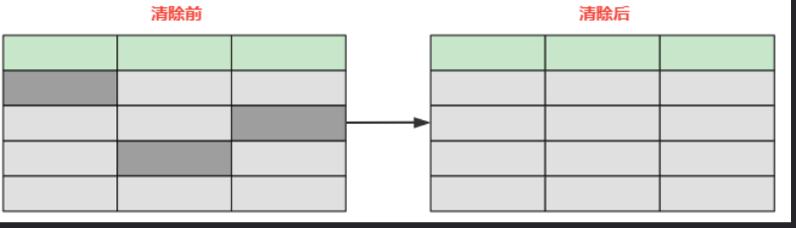

# 面试宝典

## 一、Java

## 1. Java语言

## 2. JVM

### 2.1 JVM 的内存结构

JVM的内存结构大致分为五个部分，分别是==程序计数器、虚拟机栈、本地方法栈、堆和方法区==。除此之外，还有由堆中引用的JVM外的直接内存

> ==Survivor 区分为两块 S0 和 S1 ，也可以叫做 From 和 To，在同一个时间点上，S0 和 S1 只能有一个区有数据，另外一个是空的==
>
> # 新生代、老年代 概要
>
> 当我们new一个对象后，会先放到Eden划分出来的一块作为存储空间的内存，但是我们知道对堆内存是线程共享的，所以有可能会出现两个对象共用一个内存的情况。这里JVM的处理是每个线程都会预先申请好一块连续的内存空间并规定了对象存放的位置，而如果空间不足会再申请多块内存空间
>
> 当Eden（新生代）空间满了之后，会触发一个叫做Minor GC（就是一个发生在年轻代的GC）的操作，存活下来的对象移动到Survivor0（*幸存者0区*）区。Survivor0区满后触发 Minor GC，就会将存活对象移动到Survivor1（*幸存者1区*）区
>
> 此时还会把from和to两个指针交换，这样保证了一段时间内总有一个survivor区为空且to所指向的survivor区为空。==经过多次的 Minor GC 后仍然存活的对象会移动到老年代==。老年代是存储长期存活的对象的，占满时就会触发我们最常听说的Full GC，期间会停止所有线程等待GC的完成。所以对于响应要求高的应用应该尽量去减少发生Full GC从而避免响应超时的问题（这里的存活判断是15次，对为什么是15？因为HotSpot会在对象投中的标记字段里记录年龄，分配到的空间仅有4位，所以最多只能记录到15）
>
> 而且当老年区执行了full gc之后仍然无法进行对象保存的操作，就会产生OOM，这时候就是虚拟机中的堆内存不足，原因可能会是堆内存设置的大小过小，这个可以通过参数-Xms、-Xmx来调整。也可能是代码中创建的对象大且多，而且它们一直在被引用从而长时间垃圾收集无法收集它们
>
> 
>
> # JVM 内存概要
>
> ==程序计数器==、==虚拟机栈==、==本地方法栈==，3个区域随着线程的生存而生存的。内存分配和回收都是确定的。随着线程的结束内存自然就被回收了，因此不需要考虑垃圾回收的问题
>
> ==Java堆==和==方法区==则不一样，**各线程共享**，内存的分配和回收都是动态的，因此垃圾收集器所关注的都是堆和方法这部分内存
>
> ## 如何判断对象该不该回收
>
> 在进行回收前就要判断哪些对象还存活，哪些已经死去，面介绍两个基础的计算方法
>
> ### 引用计数器计算
>
> 给对象添加一个引用计数器，每次引用这个对象时计数器加一，引用失效时减一，计数器等于0时就是不会再次使用的。不过这个方法有一种情况就是出现对象的循环引用时GC没法回收
>
> ### 可达性分析计算
>
> 这是一种类似于二叉树的实现，将一系列的GC ROOTS作为起始的存活对象集，从这个节点往下搜索，搜索所走过的路径成为引用链，把能被该集合引用到的对象加入到集合中。搜索当一个对象到GC Roots没有使用任何引用链时，则说明该对象是不可用的，在Java语言汇总能作为GC Roots的对象分为以下几种；这种方法的优点是能够解决循环引用的问题，可它的实现需要耗费大量资源和时间，也需要GC（它的分析过程引用关系不能发生变化，所以需要停止所有进程）
>
> - 虚拟机栈（栈帧中的本地方法表）中引用的对象（局部变量）
> - 方法区中静态变量所引用的对象（静态变量）
> - 方法区中常量引用的对象
> - 本地方法栈（即native修饰的方法）中JNI引用的对象（JNI是Java虚拟机调用对应的C函数的方式，通过JNI函数也可以创建新的Java对象。且JNI对于对象的局部引用或者全局引用都会把它们指向的对象都标记为不可回收）
> - 已启动的且未终止的Java线程
>
> #### 判断一个对象的死亡至少需要两次标记
>
> 如果对象进行可达性分析之后没发现与GC Roots相连的引用链，那它将会第一次标记并且进行一次筛选。判断的条件是决定这个对象是否有必要执行finalize()方法。如果对象有必要执行finalize()方法，则被放入F-Queue队列中
>
> GC对F-Queue队列中的对象进行二次标记。如果对象在finalize()方法中重新与引用链上的任何一个对象建立了关联，那么二次标记时则会将它移出“即将回收”集合。如果此时对象还没成功逃脱，那么只能被回收了
>
> # 垃圾回收算法（精简）
>
> ## 标记清除算法
>
> 标记清除算法就是分为“标记”和“清除”两个阶段。标记（把已死亡的对象标记为空闲内存）出所有需要回收的对象，标记结束后统一回收；不足的方面就是标记和清除的效率比较低下。且这种做法会让内存中的==碎片非常多==。这个导致了如果我们需要使用到较大的内存块时，无法分配到足够的连续内存
>
> ## 复制算法
>
> 为了==解决碎片问题==，复制算法就出现了。它将可用内存按容量划分成两等分，每次只使用其中的一块。和survivor一样也是用from和to两个指针这样的玩法。fromPlace存满了，就把存活的对象copy到另一块toPlace上，然后交换指针的内容。这样就解决了碎片的问题。这个算法的代价就是把内存缩水了，这样堆内存的使用效率就会变得十分低下了
>
> ## 标记-整理（压缩）算法
>
> **标记整理算法执行步骤：**
>
> - 1 标记存活对象
>
> 
>
> - 2 整理存活对象； 有序地整理存活对象，在整理的同时，之前对象的在虚拟机栈中的引用地址也发生改变
>
> 
>
> - 3 清除非存活对象
>
> 
>
> ###  标记整理算法的优缺点
>
> #### 优点
>
> - （相比于标记清除算法）没有了碎片化内存
>
> - （相比于标复制算法）没有了内存减半的消耗
>
>
> #### 缺点
>
> - 在整理存活对象时，因为对象位置点变动，还需要该调整虚拟机栈中的引用地址
>
> - 在整理存活对象时，需要全程暂停用户线程，STW（Stop The World）
> - 效率相比于标记复制算法低一些
>
> ## 分代收集算法
>
> 目前JVM常用回收算法就是分代回收，==年轻代以复制算法为主，老年代以标记整理算法为主==
>
> 年轻代对象比较多，每次垃圾回收都有很多的垃圾对象回收，而且要尽可能快的减少生命周期短的对象，存活的对象较少，这时候复制算法比较适合，只要将有标记的对象复制到另一个内存区域，其余全部清除，并且复制的数量较少，效率较高
>
> 老年代是年轻代筛选出来的对象，被标记比较高，需要删除的对象比较少，显然采用标记整理效率较高

==程序计数器== ===> 用于记录下一条JVM指令的执行地址（如果正在执行的是本地方法则为空）

要注意的是，程序计数器时线程私有的，每一个线程都有一个程序计数器，只有这么设计，当CPU因为时间片轮转等原因切换线程的时候，才能保存当前线程的执行进度。同时，程序计数器不会存在内存溢出

==虚拟机栈== ===> 每个线程运行时所需要的内存，称为虚拟机栈

每个栈由多个栈帧（Frame）组成，对应着每次方法调用时所占用的内存，用于存储局部变量表、操作数栈、常量池引用等信息

从方法调用直至执行完成的过程，对应着一个栈帧在 Java 虚拟机栈中入栈和出栈的过程

==本地方法栈== ===> 本地方法栈与 Java 虚拟机栈类似，它们之间的区别只不过是本地方法栈为本地方法服务

本地方法一般是用其它语言（C、C++ 或汇编语言等）编写的，并且被编译为基于本机硬件和操作系统的程序，对待这些方法需要特别处理

==堆== ===> 所有对象都在这里分配内存，是垃圾收集的主要区域（“GC 堆”）

现代的垃圾收集器基本都是采用分代收集算法，其主要的思想是针对不同类型的对象采取不同的垃圾回收算法。可以将堆分成两块：

Eden （新生代、伊甸园）（Young Generation） ===> 

老年代（Old Generation） ===> 

堆不需要连续内存，并且可以动态增加其内存，增加失败会抛出 OutOfMemoryError 异常

==方法区== ===> 用于存放已被加载的类信息、常量、静态变量、即时编译器编译后的代码等数据

和堆一样不需要连续的内存，并且可以动态扩展，动态扩展失败一样会抛出 OutOfMemoryError 异常

对这块区域进行垃圾回收的主要目标是对常量池的回收和对类的卸载，但是一般比较难实现

HotSpot 虚拟机把它当成永久代来进行垃圾回收。但很难确定永久代的大小，因为它受到很多因素影响，并且每次 Full GC 之后永久代的大小都会改变，所以经常会抛出 OutOfMemoryError 异常

为了更容易管理方法区，从 JDK 1.8 开始，移除永久代，并把方法区移至元空间，它位于本地内存中，而不是虚拟机内存中

`方法区是一个 JVM 规范，永久代与元空间都是其一种实现方式。在 JDK 1.8 之后，原来永久代的数据被分到了堆和元空间中。元空间存储类的元信息，静态变量和字符串常量池等放入堆中`

==运行时常量池== ===> 运行时常量池是方法区的一部分

常量池，就是一张表，虚拟机指令根据这张常量表找到要执行的类名、方法名、参数类型、字面量等信息

运行时常量池，常量池是 *.class 文件中的，当该类被加载，它的常量池信息就会放入运行时常量池，并把里面的符号地址变为真实地址

==字符串常量池== ===>  字符串常量池在1.7版本后放到了堆中

### 2.2 JVM 调优高频面试题

#### 2.2.1 JVM调优涉及到两个很重要的概念

**吞吐量、响应时间**、内存占用

**jvm调优主要是针对他们进行调整优化，达到一个理想的目标，根据业务确定目标是吞吐量优先还是响应时间优先**。这三个属性中，其中一个任何一个属性性能的提高，几乎都是以另外一个或者两个属性性能的损失作代价，不可兼得，具体某一个属性或者两个属性的性能对应用来说比较重要，要基于应用的业务需求来确定

#### 2.2.2 JVM 调优步骤

> ###### 前提知识
>
> - 已了解jvm 垃圾收集器 
> - 已了解jvm 性能监控常用工具 
> - 能够读懂gc日志 
> - 确信不为了调优而调优
> - jvm调优不能解决一切性能问题
>
> 
>
> ###### 遵循原则
>
> MinorGC回收原则： 每次 GC 都要尽可能多的收集垃圾对象。以减少应用程序发生Full GC的频率
>
> GC内存最大化原则：处理吞吐量和延迟问题时候，垃圾处理器能使用的内存越大，垃圾收集的效果越好，应用程序也会越来越流畅。 
>
> GC调优3选2原则:  在性能属性里面，吞吐量、延迟、内存占用，我们只能选择其中两个进行调优，不可三者兼得
>
> 
>
> ###### JVM内存概要
>
> - 堆内存线程共享
> - 栈内存线程独有
>
> 当我们new一个对象后，会先放到Eden划分出来的一块作为存储空间的内存，但是我们知道对堆内存是线程共享的，所以有可能会出现两个对象共用一个内存的情况。这里JVM的处理是每个线程都会预先申请好一块连续的内存空间并规定了对象存放的位置，而如果空间不足会再申请多块内存空间

调优的前提是熟悉业务场景，先判断出当前业务场景是吞吐量优先还是响应时间优先。调优需要建立在监控之上，由压力测试来判断是否达到业务要求和性能要求

选择合适的垃圾回收器组合，如果是吞吐量优先，则选择ps+po组合；如果是响应时间优先，在1.8以后选择G1，在1.8之前选择ParNew+CMS组合

规划内存需求，只能进行大致的规划

CPU选择，在预算之内性能越高越好

根据实际情况设置升级年龄，最大年龄为15

设定日志参数

## 3. 高并发

#### 3.1 什么是高并发

==高并发== ===> 是互联网分布式系统架构设计中必须考虑的因素之一，它通常是指，通过设计保证系统能够同时并行处理很多请求

#### 3.2 高并发的指标

- 响应时间（Response Time）

- 吞吐量（Throughput）

- 每秒查询率QPS（Query Per Second）
- 并发用户数等

#### 3.3 高并发的解决方案

从最基础的地方做起，优化我们写的代码，减少不必要的资源浪费

避免频繁的使用new对象，对于整个应用只需要存在一个实例的类，我们可以使用单例模式

对于String连接操作，使用StringBuffer或StringBuilder，对于工具类可以通过静态方法来访问

图片服务器分离

尽量使用缓存，包括用户缓存，信息缓存等，多花点内存来做缓存，可以大量减少与数据库的交互，提高性能

数据库集群

DB优化

在数据库设计的时候就要考虑到后期的维护，数据库三范式是我们设计数据库索要遵循的原则

合理应用数据库索引

`当执行 select 查询语句时，用没用到索引区别是很大的`

`若在区分度较高的字段上添加索引，并以该字段为筛选条件进行更新，则无论是更新该字段还是其他字段，用到索引的更新都要快好多`

`若在区分度很低的字段上添加索引，并以该字段为筛选条件进行更新，当更新其他字段时，有无索引区别不大，当更新这个区分度很低的字段时，用到索引的更新反而更慢`

表字段的类型选择要恰当包括字段的长度、类型等，要根据实际存储的数据进行选择，长度不要过长，否则会影响效率

外键要慎用

负载均衡

消息队列（Kafka、RabitMQ、RocketMQ）

应用拆分（服务化（Dubbo）与微服务（Spring Cloud））

服务降级与服务熔断：服务降级的多重选择、Hystrix

分布式

## 二、数据库

### 1. redis

#### 1.1 redis 快的原因

- 采用了多路复用io阻塞机制（IO多路复用，是建立在内核上提供的多路分离函数select基础之上的）
- 运行在内存中

> 名词解释：
>
> 多路是指网络连接
> 复用指的是同一个线程

#### 1.2 Redis高可用的三种实现方式

> 高可用的概念
>
> 高可用(High Availability,即HA)，指的是通过尽量缩短日常维护操作和突发的系统崩溃所导致的停机时间，以提高系统和应用的可用性。一个业务系统如果全年无一时刻不在提供服务，它的可用性可达100%，高可用一般来说有两个含义：
>
> - 数据尽量不丢失
> - 保证服务尽可能可用
>
> ==数据持久化保证了数据尽量不丢失==,而==多节点来保证服务尽可能提供服务==。单个节点的系统缺点明显，一旦发生故障会导致服务不可用。而且，单个节点处理所有的请求，吞吐量有限，容量也有限

Redis实现高可用，在于提供多个节点，通常有三种部署模式：**主从模式**，**哨兵模式**，**集群模式**

##### 1.2.1 主从模式

主从模式就是，部署多台Redis节点，其中只有一台节点是主节点（master），其他的节点都是从节点（slave）。主从模式实现读写分离，只有master节点提供数据的事务性操作（增删改），slave节点只提供读操作。所有slave节点的数据都是从master节点同步过来的

##### 1.2.2 哨兵模式

在主从模式中，一旦master节点发生宕机，为了保证高可用，需要找一个slave节点作为新的master节点。谁来确定宕机，选择哪一个slave节点，这些问题都没有解决。哨兵(sentinal)模式则是为了解决这些问题而产生的，它用于对主从模式中每个节点进行监控，当出现故障时通过投票机制，选择新的master节点，并将所有的slave节点连接到master节点，架构如下图所示

哨兵模式有三个作用：==监控==、==通知==和==自动故障转移==。优点是保证高可用。能够监控各个节点运行状况，进行自动故障转移。

- 监控(Monitoring)：不断地检查master和salve是否运行正常。master存活检测、master和slave运行情况检测
- 通知(Notification)：当被监控的某个节点出现问题时， Sentinel 可以通过 API 向管理员或者其他应用程序发送通知
- 自动故障转移(Automatic failover)：断开master与slave之间的连接，选取一个salve作为master，将其他slave连接到新的master，并告知客户端新的节点地址

##### 1.2.3 集群模式

哨兵模式基本已经实现了高可用，但是每个节点都存储相同的内容，很浪费内存。而且，哨兵模式没有解决master写数据的压力。为了解决这些问题，就有了集群模式，实现分布式存储，每个节点存储不同的内容。集群部署的方式能自动将数据进行分片，每个master上放一部分数据，提供了内置的高可用服务，即使某个master宕机了，服务还可以正常地提供，架构如下图所示

集群模式中数据通过数据分片的方式被自动分割到不同的master节点上，每个Redis集群有16384个哈希槽，进行set操作时，每个key会通过CRC16校验后再对16384取模来决定放置在哪个槽。数据在集群模式中是分开存储的，那么节点之间想要知道其他节点的状态信息，包括当前集群状态、集群中各节点负责的哈希槽、集群中各节点的master-slave状态、集群中各节点的存活状态等是通过建立TCP连接，使用gossip协议来进行集群信息传播

#### 1.3 缓存穿透、缓存击穿、缓存雪崩及其解决方法

##### 1.3.1 缓存穿透

缓存穿透是指查询一个缓存中和数据库中都不存在的数据，导致每次查询这条数据都会透过缓存，直接查库，最后返回空。当用户使用这条不存在的数据疯狂发起查询请求的时候，对数据库造成的压力就非常大，甚至可能直接挂掉

> # 缓存穿透解决方案
>
> 解决缓存穿透的方法一般有两种，第一种是缓存空对象，第二种是使用布隆过滤器
>
> ## 缓存空对象
>
> 第一种方法比较好理解，就是当数据库中查不到数据的时候，我缓存一个空对象，然后给这个空对象的缓存设置一个过期时间，这样下次再查询该数据的时候，就可以直接从缓存中拿到，从而达到了减小数据库压力的目的。但这种解决方式有两个缺点：（1）需要缓存层提供更多的内存空间来缓存这些空对象，当这种空对象很多的时候，就会浪费更多的内存；（2）会导致缓存层和存储层的数据不一致，即使在缓存空对象时给它设置了一个很短的过期时间，那也会导致这一段时间内的数据不一致问题
>
> ## 布隆过滤器
>
> 第二种方案是使用布隆过滤器，这是比较推荐的方法。所谓布隆过滤器，就是一种数据结构，它是由一个长度为m bit的位数组与n个hash函数组成的数据结构，位数组中每个元素的初始值都是0。在初始化布隆过滤器时，会先将所有key进行n次hash运算，这样就可以得到n个位置，然后将这n个位置上的元素改为1。这样，就相当于把所有的key保存到了布隆过滤器中了
>
> 这样，当客户端查询时，也对查询的 key 做 n 次 hash 运算得到n个位置，然后看布隆过滤器中对应位置元素的值是否为1，如果所有对应位置元素的值都为1，就证明key在库中存在，则继续向下查询；如果3个位置中有任意一个位置的值不为1，那么就证明 key 在库中不存在，直接返回客户端空即可

##### 1.3.2 缓存击穿

缓存击穿是指当缓存中某个热点数据过期了，在该热点数据重新载入缓存之前，有大量的查询请求穿过缓存，直接查询数据库。这种情况会导致数据库压力瞬间骤增，造成大量请求阻塞，甚至直接挂掉

> # 缓存击穿解决方案
>
> 解决缓存击穿的方法也有两种，第一种是设置key永不过期；第二种是使用分布式锁，保证同一时刻只能有一个查询请求重新加载热点数据到缓存中，这样，其他的线程只需等待该线程运行完毕，即可重新从Redis中获取数据
>
> ## 设置key永不过期
>
> 第一种方式比较简单，在设置热点key的时候，不给key设置过期时间即可。不过还有另外一种方式也可以达到key不过期的目的，就是正常给key设置过期时间，不过在后台同时启一个定时任务去定时地更新这个缓存
>
> ## 使用分布式锁
>
> 第二种方式使用了加锁的方式，锁的对象就是key，这样，当大量查询同一个key的请求并发进来时，只能有一个请求获取到锁，然后获取到锁的线程查询数据库，然后将结果放入到缓存中，然后释放锁，此时，其他处于锁等待的请求即可继续执行，由于此时缓存中已经有了数据，所以直接从缓存中获取到数据返回，并不会查询数据库

##### 1.3.3 缓存雪崩

缓存雪崩是指当缓存中有大量的key在同一时刻过期，或者Redis直接宕机了，导致大量的查询请求全部到达数据库，造成数据库查询压力骤增，甚至直接挂掉

> # 缓存雪崩解决方案
>
> 针对第一种大量key同时过期的情况，解决起来比较简单，只需要将每个key的过期时间打散即可，使它们的失效点尽可能均匀分布
>
> 针对第二种redis发生故障的情况，部署redis时可以使用redis的几种高可用方案部署

### 2.事务

#### 2.1事务的隔离级别

==DEFAULT 默认隔离级别==，每种数据库支持的事务隔离级别不一样，如果Spring配置事务时将isolation设置为这个值的话，那么将使用底层数据库的默认事务隔离级别。顺便说一句，如果使用的MySQL，可以使用"select @@tx_isolation"来查看默认的事务隔离级别

==READ_UNCOMMITTED 读未提交==，即能够读取到没有被提交的数据，所以很明显这个级别的隔离机制无法解决脏读、不可重复读、幻读中的任何一种，因此很少使用

==READ_COMMITED 读已提交==，即能够读到那些已经提交的数据，自然能够防止脏读，但是无法限制不可重复读和幻读
REPEATABLE_READ 重复读取，即在数据读出来之后加锁，类似"select * from XXX for update"，明确数据读取出来就是为了更新用的，所以要加一把锁，防止别人修改它

==REPEATABLE_READ 重复读== 的意思也类似，读取了一条数据，这个事务不结束，别的事务就不可以改这条记录，这样就解决了脏读、不可重复读的问题，但是幻读的问题还是无法解决

==SERLALIZABLE 序列化==，最高的事务隔离级别，不管多少事务，挨个运行完一个事务的所有子事务之后，才可以执行另外一个事务里面的所有子事务，这样就解决了脏读、不可重复读和幻读的问题了

> - 脏读：事务A读取了事务B中尚未提交的数据。如果事务B回滚，则A读取使用了错误的数据
> - 幻读：在事务A多次读取构成中，事务B对数据进行了新增操作，导致事务A多次读取的数据不一致
> - 不可重复度：不可重复读是指在对于数据库中的某个数据，一个事务范围内多次查询却返回了不同的数据值，这是由于在查询间隔，被另一个事务修改并提交了

> 幻读和不可重复读的区别在于：
>
> 不可重复是针对记录的update操作，只要在记录上加写锁，就可避免
> 幻读是对记录的insert操作，要禁止幻读必须加上全局的写锁(比如在表上加写锁)

#### 2.2 事务的四大特性

==原子性（Atomicity）==
原子性是指事务包含的所有操作要么全部成功，要么全部失败回滚，这和前面两篇博客介绍事务的功能是一样的概念，因此事务的操作如果成功就必须要完全应用到数据库，如果操作失败则不能对数据库有任何影响`

==一致性（Consistency）==
一致性是指事务必须使数据库从一个一致性状态变换到另一个一致性状态，也就是说一个事务执行之前和执行之后都必须处于一致性状态

==隔离性（Isolation）==
隔离性是当多个用户并发访问数据库时，比如操作同一张表时，数据库为每一个用户开启的事务，不能被其他事务的操作所干扰，多个并发事务之间要相互隔离

==持久性（Durability）==
持久性是指一个事务一旦被提交了，那么对数据库中的数据的改变就是永久性的，即便是在数据库系统遇到故障的情况下也不会丢失提交事务的操作

#### 2.3 事务的传播行为

REQUIRED: 如果当前没有事务，就新建一个事务，如果已经存在一个事务中，加入到这个事务中。一般的选择（默认值）

==SUPPORTS: 支持当前事务==，如果当前没有事务，就以非事务方式执行（没有事务）

==MANDATORY: 使用当前的事务==，如果当前没有事务，就抛出异常

==REQUERS_NEW: 新建事务==，如果当前在事务中，把当前事务挂起

==NOT_SUPPORTED==: 以非事务方式执行操作，如果当前存在事务，就把当前事务挂起

==NEVER: 以非事务方式运行==，如果当前存在事务，抛出异常

==NESTED: 如果当前存在事务，则在嵌套事务内执行==。如果当前没有事务，则执行 REQUIRED 类似的操作

#### 2.4 全局事务和局部事务

#### 2.5 分布式事务

微服务中单体应用被拆成了微服务，每个服务都是一个分别使用单独的一个数据源。三个服务之间通过RPC实现业务调用，每一个服务内部的数据一致性仍由本地事务来保证。而整个业务层面的全局数据一致性要如何保障呢？

典型的分布式事务需求：我们需要一个分布式事务的解决方案保障业务全局的数据一致性。

##### 2.5.1 什么是分布是事务？

分布式事务就是为了保证不同数据库的数据一致性，部署在不同节点上的系统通过网络交互来完成协同工作的系统，例如订单系统和库存系统是两个系统，一次下单的操作由两个系统协同完成

##### 2.5.2 分布式事务解决方案（需补充）

Seata(alibaba) 

Seata 的设计思路是将一个分布式事务可以理解成一个全局事务，下面挂了若干个分支事务，而一个分支事务是一个满足 ACID 的本地事务，因此我们可以操作分布式事务像操作本地事务一样

我们的微服务分布式中主要使用的是seate中的AT模式，seate又称简单可扩展自治事务框架，解决分布式事务问题，有两个设计初衷：

- 对业务无侵入：即减少技术架构上的微服务化所带来的分布式事务问题对业务的侵入
- 高性能：减少分布式事务解决方案所带来的性能消耗

> ###### Seata 中有两种分布式事务实现方案，AT 及 MT（TCC）
>
> - AT模式主要关注多 DB 访问的数据一致性，当然也包括多服务下的多 DB 数据访问一致性问题 
> - 2PC-改进 TCC 模式主要关注业务拆分，在按照业务横向扩展资源时，解决微服务间调用的一致性问题
>
> 
>
> ###### 一个分布式事务在Seata中的执行流程
>
> 1. TM 向 TC 申请开启一个全局事务，全局事务创建成功并生成一个全局唯一的 XID
> 2. XID 在微服务调用链路的上下文中传播
> 3. RM 向 TC 注册分支事务，接着执行这个分支事务并提交（重点：RM在第一阶段就已经执行了本地事务的提交/回滚），最后将执行结果汇报给TC
> 4. TM 根据 TC 中所有的分支事务的执行情况，发起全局提交或回滚决议
> 5. TC 调度 XID 下管辖的全部分支事务完成提交或回滚请求
> 6. Seata 中有三大模块，分别是 TM、RM 和 TC。 其中 TM 和 RM 是作为Seata 的客户端与业务系统集成在一起，TC 作为 Seata 的服务端独立部署

### 3.三大范式（NF）

==范式==：符合某一种级别的关系模式的集合，表示一个关系内部各属性之间的联系的合理化程度

#### 第一范式

数据库表中的所有字段都只具有单一属性，单一属性的列是由基本数据类型所构成的，设计出来的表都是简单的二维表

`所有的域都应该是原子性的，即数据库表的每一列都是不可分割的原子数据项，而不能是集合，数组，记录等非原子数据项`

#### 第二大式

在1NF的基础上，非码属性必须完全依赖于候选码

`第二范式（2NF）是在第一范式（1NF）的基础上建立起来的，即满足第二范式（2NF）必须先满足第一范式（1NF）。第二范式（2NF）要求数据库表中的每个实例或记录必须可以被唯一地区分。选取一个能区分每个实体的属性或属性组，作为实体的唯一标识`

#### 第三范式

在2NF基础上，任何非主属性不依赖于其它非主属性（在2NF基础上消除传递依赖）

`即非主属性不能与非主属性之间有依赖关系，非主属性必须直接依赖于主属性，不能间接依赖主属性`

#### BCNF 范式

在第三范式的基础上，任何非主属性不能对主键子集依赖（在第3NF的基础上，消除对主码子集的依赖）

#### 数据库缓存问题（缓存雪崩、缓存击穿、缓存穿透）

##### 产生原因

用户的数据一般都是存储于数据库，数据库的数据是落在磁盘上的，因为磁盘的读写速度比较慢，所以当用户的请求，都访问数据库的话，请求数量一上来，数据库很容易就奔溃的了，因此为了避免用户直接访问数据库，会用 Redis 作为缓存层。

因为 Redis 是内存数据库，所以我们可以将数据库的数据缓存在 Redis 里，相当于数据缓存在内存，内存的读写速度比硬盘快好几个数量级，这样大大提高了系统性能；但是引入了缓存层，就会有缓存异常的三个问题，分别是**缓存雪崩、缓存击穿、缓存穿透**

##### 缓存雪崩

###### 概述

通常我们为了保证缓存中的数据与数据库中的数据一致性，会给 Redis 里的数据设置过期时间，当缓存数据过期后，用户访问的数据如果不在缓存里，业务系统需要重新生成缓存，因此就会访问数据库，并将数据更新到 Redis 里；

那么，当**大量缓存数据在同一时间过期（失效）或者 Redis 故障宕机**时，如果此时有大量的用户请求，都无法在 Redis 中处理，于是全部请求都直接访问数据库，从而导致数据库的压力骤增，严重的会造成数据库宕机，从而形成一系列连锁反应，造成整个系统崩溃，这就是**缓存雪崩**的问题	

###### 产生原因

- 大量数据同时过期
- Redis 故障宕机

###### 解决方案

**针对大量数据同时过期而引发的缓存雪崩问题，常见的应对方法有下面这几种**

- 均匀设置过期时间
- 互斥锁
- 双 key 策略
- 后台更新缓存

**针对 Redis 故障宕机而引发的缓存雪崩问题，常见的应对方法有下面这几种**

- 服务熔断或请求限流机制
- 构建 Redis 缓存高可靠集群

##### 缓存击穿

###### 概述

我们的业务通常会有几个数据会被频繁地访问，比如秒杀活动，这类被频地访问的数据被称为热点数据

如果缓存中的**某个热点数据过期**了，此时大量的请求访问了该热点数据，就无法从缓存中读取，直接访问数据库，数据库很容易就被高并发的请求冲垮，这就是**缓存击穿**的问题

###### 产生原因

热点数据过期

###### 解决方案

- 互斥锁方案，保证同一时间只有一个业务线程更新缓存，未能获取互斥锁的请求，要么等待锁释放后重新读取缓存，要么就返回空值或者默认值
- 不给热点数据设置过期时间，由后台异步更新缓存，或者在热点数据准备要过期前，提前通知后台线程更新缓存以及重新设置过期时间

##### 缓存穿透

###### 概述

当用户访问的数据，**既不在缓存中，也不在数据库中**，导致请求在访问缓存时，发现缓存缺失，再去访问数据库时，发现数据库中也没有要访问的数据，没办法构建缓存数据，来服务后续的请求。那么当有大量这样的请求到来时，数据库的压力骤增，这就是**缓存穿透**的问题

###### 产生原因

- 业务误操作，缓存中的数据和数据库中的数据都被误删除了，所以导致缓存和数据库中都没有数据
- 黑客恶意攻击，故意大量访问某些读取不存在数据的业务

###### 解决方案

- 第一种方案，非法请求的限制
- 第二种方案，缓存空值或者默认值
- 第三种方案，使用布隆过滤器快速判断数据是否存在，避免通过查询数据库来判断数据是否存在

### 4 SQL优化

#### 4.1 一条sql执行过长的时间，你如何优化，从哪些方面？

- 执行前，当一个请求发来时先进服务器（Tomcat）,在服务器中会有拦截器，过滤器啊，等这些功能走完之后，才真正的进入了框架中
- 查看sql是否涉及多表的联表或者子查询，如果有，看是否能进行业务拆分，相关字段冗余或者合并成临时表（业务和算法的优化）
- 涉及链表的查询，是否能进行分表查询，单表查询之后的结果进行字段整合
- 如果以上两种都不能操作，非要链表查询，那么考虑对相对应的查询条件做索引。加快查询速度
- 针对数量大的表进行历史表分离（如交易流水表）
- 数据库主从分离，读写分离，降低读写针对同一表同时的压力，至于主从同步，MySQL有自带的binlog实现 主从同步
- explain分析sql语句，查看执行计划，分析索引是否用上，分析扫描行数等等
- 查看mysql执行日志，看看是否有其他方面的问题

#### 4.2 **双十一秒杀==高可靠==如何实现？**

- 流量控制（通过设置QPS来控制）
- 熔断机制（熔断就是切断坏路，让后续新流量再走这个坏路）
- 降级处理（备选B角，走了try-cath的机制，），三板斧解决高可靠

## 三、Spring 系列

### 3 常见面试问题

**SpringMVC工作流程？**

- 执行前，当一个请求发来时先进服务器（Tomcat）,在服务器中会有拦截器，过滤器啊，等这些功能走完之后，才真正的进入了框架中
- 用户请求旅程的第一站是 ==DispatcherServlet==（前端控制器）
- 收到请求后，DispatcherServlet 调用 ==HandlerMapping==（处理器映射器）
- HandlerMapping 根据 DispatcherServlet 发来的用户的请求找到对应符合的 Handler, 并且将其封装成处理器执行链，返回给前端控制器;处理器适配器接收到来自前端控制器的执行链后，找到对应执行此执行链的处理器适配器（HandlerAdapter）来调用的具体的控制器（就是说其对应的方法或者逻辑）
- 拿到 ==Handler==（程序员自己创建的控制器） 后，找到 ==HandlerAdapter==处理器适配器（） ,通过它来访问 Handler ,并执行处理器
- 执行 Handler 的逻辑
- Handler 会返回一个 ModelAndView 对象给 DispatcherServlet
- 请求 ==ViewResolver==（视图解析器） 解析视图，根据逻辑视图名解析成真正的 ==View==（是开发者自己提供的 视图）
- 返回 View 给 DispatcherServlet
- DispatcherServlet 对 View进行渲染视图
- DispatcherServlet 响应用户

## 四、Spring Boot 系列

## 五、Spring Cloud 系列

### 3 常见面试问题

**nacos和zookeeper是如何防止脑裂的？**

集群的脑裂通常是发生在集群之间通信不可达（分区）的情况下，一个大集群会分裂成不同的小集群，小集群中又各自选举出自己的master节点，导致原先的集群出现多个master节点对外提供服务的情况！

leader选举时，要求节点获取到的投票数量 > 总节点数量/2，有了这个选举原则，当发生网络分区时，无论如何最多只有一个小集群选出leader，避免集群发生脑裂

**Spring Cloud 和dubbo区别?**

服务调用方式

- dubbo是RPC
- SpringCloud采用Rest Api

注册中心

- dubbo 是 nacos、zookeeper
- SpringCloud 是 eureka，也可以是nacos、zookeeper

服务网关

- dubbo本身没有实现，只能通过其他第三方技术整合，
- SpringCloud有 Zuul 路由网关，作为路由服务器，进行消费者的请求分发,springcloud支持断路器，与git完美集成配置文件支持版本控制，事物总线实现配置文件的更新与服务自动装配等等一系列的微服务架构要素